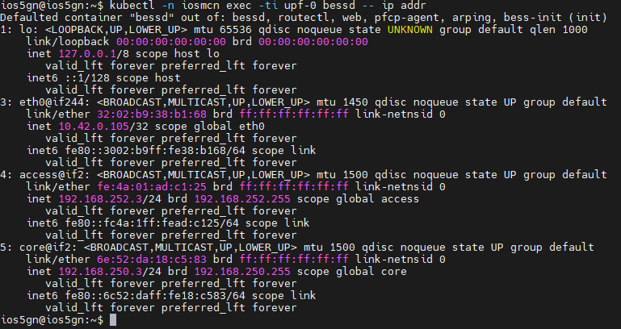
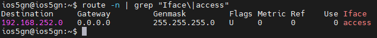
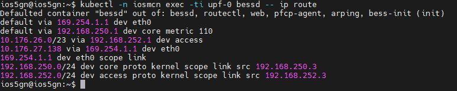
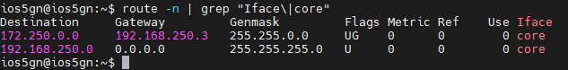


# IOS MCN v0.1.0 Agartala Release Installation Guide: IOSMCN-Core v0.1

# Introduction

The core software for the India Open Source for Mobile Communication Network (IOS-MCN) is based on open-source SD-Core. In this document, includes the installation and configurations for making the platform up and running for the integration with RAN and UPF. This includes emulated RAN test with built in tool.

#  Purpose and Audience

This document is for installing and configuring the IOS-MCN core software on the server. It can be connected to RAN, attach UEs and integrate with UPF.

#  Installation methods

The installation can be proceeded with this documentation and the core can get from IOS-MCN git repository.  The details of each step are given on next section.

#  Installation

##  Hardware Requirements

The IOSMCN-Core installation requires the following prerequisites

- 4 Cores

- 16 GB RAM

- 40 GB Disk Storage

##  Software Prerequisites

- Ubuntu 22.04 LTS Operating system

- Git

- Curl

- Make

- Net tools

- Netplan

- Ansible

- Python3

- Docker.io
  
- openssh-server

- Ethtool

##   Prerequisite Installation

Login to the Ubuntu 22.04.5 LTS desktop and take a terminal. The internet access is required for the machine.

Update the repository by the command
```
sudo apt update
```
After the successful completion of repository update start installing the required tools.
```
sudo apt install git curl make net-tools pipx python3-venv docker.io

pipx install --include-deps ansible

pipx ensurepath

sudo apt install sshpass netplan.io iptables openssh-server ethtool
```
##  Prerequisite Environment

###  Firewall status

Verify the firewall is inactive on the system using the command
```
sudo ufw status
```
If the firewall is active, disable the firewall using the command
```
sudo ufw disable
```
###  Networkd status

Verify the _systemd-networkd_ status for the network configuration using the command
```
systemctl status systemd-networkd.service
```
###  Disable Generic receive offload (GRO)

Find the interface from the _ifconfig_ command and input the interface name to the following command
```
sudo ethtool -K \<core-interface\> gro off
```
##  Installation of IOS-MCN Core

###  Download core image

create a directory for IOSMCN-Core in home directory as per the following commands
```
cd

mkdir IOSMCN-Core

cd IOSMCN-Core
```
Download file: [iosmcn.agartala.v0.1.0.core.images.tar.gz](../release-images/iosmcn.agartala.v0.1.0.core.images.tar.gz) to the directory
```
tar -xvzf iosmcn.agartala.v0.1.0.core.images.tar.gz

cd iosmcn.agartala.v0.1.0.core.images/IOSMCN-CoreDpm
```
This brings up a Kubernetes cluster, deploy a 5G version of IOSMCN-Core on that cluster, and then connect that IOSMCN-Core to either an emulated 5G RAN or physical RAN.

###  Target Parameter Settings

Open the hosts.ini file

```
_vi hosts.ini_
```

Update IP address, username and password of the system

eg.,

_node1  ansible_host=10.176.26.86 ansible_user=ios5gn ansible_password=ios5gn ansible_sudo_pass=ios5gn_

Open vars/main.yml

```
_vi  vars/main.yml_
```
Update data_iface name on _core_:

eg.,

_data_iface: ens3_

Update data_iface name on _gnbsim:router:_

_gnbsim:_

_router:_

_data_iface: ens3_

Update IP address of the system

_amf:_

_ip: "10.176.26.86"_


Figure 1: Parameter settings in var/main.yml

If locate is not UTF-8, set locale
```
sudo vi /etc/default/locale
```
eg.,
_#  File generated by update-locale_

_LANG="en_IN.UTF-8"_

_LANGUAGE="en_IN:en"_

Reboot the system for updating the locale


###   Install Kubernetes

Start installation with the command
```
make k8s-install
```
This may take several minutes to complete the installation. On its completion, verify the installation status by the command
```
kubectl get pods --all-namespaces
```
The successful output looks like


Figure 2: Output of Kubernetes installation

###  Pre-Configuration for IOSMCN-Core

Verify the netpan file is configured with IP, Gateway and DNS address.

Common filenames include:

- /etc/netplan/50-cloud-init.yaml
- /etc/netplan/01-netcfg.yaml
- /etc/netplan/00-installer-config.yaml

```
nano /etc/netplan/00-installer-config.yaml
```
eg.,


where,
- Replace _ens3_ with the system's network interface.
- Under the interface section, set the addresses field to the system's IP address.
- Specify the DNS IP under nameservers.addresses.
- If no DNS is configured on the network, use 8.8.8.8 as the DNS IP.

If any change on the configuration, execute the command:
```
sudo netplan apply
```
###  Configure IOSMCN-Core

Modify the subscribers block of the omec-sub-provision section in file _deps/5gc/roles/core/templates/iosmcn-5g-values.yaml_ to record the IMSI, OPc, and Key values configured onto your SIM cards. For example, the following code block adds IMSIs between 001010000000001 and 001010000000003


Further down in the same omec-sub-provision section you will find two other blocks that also need to be edited. The first, device-groups, assigns IMSIs to _Device Groups_. You will need to reenter the individual IMSIs from the subscribers block that will be part of the device-group. Also, update the DNS.


The second block, network-slices, sets various parameters associated with the _Slices_ that connect device groups to applications. Here, you will need to reenter the PLMN information


###  Install IOSMCN-Core

Initiate the installation by the command
```
make 5gc-install
```
The successful outcome shall be verified using the following command
```
kubectl get pods -n iosmcn
```


_Figure 3: Success state of IOSMCN-Core installation_


##  Add Route in gNB

In core machine, run following command to get the AMF service IP:
```
kubectl get svc -n iosmcn
```


Add route in gNB machine to AMF service IP:
```
sudo ip route add \<amf-service-ip\> via <core_ip>
```
Add route in gNB machine to UPF:
```
sudo ip route add 192.168.252.0/24 via <core_ip>
```
##  Verify Network

###  Check core and access are properly configured outside the container

There are two bridges that connect the physical interface with the UPF container. The access bridge connects the UPF downstream to the RAN (this corresponds to 3GPP’s N3 interface) and is assigned IP subnet 192.168.252.0/24 . The core bridge connects the UPF upstream to the Internet (this corresponds to 3GPP’s N6 interface) and is assigned IP subnet 192.168.250.0/24 .


The above output from ip shows the two interfaces visible to the server, but running outside the container.

###  Check core and access are properly configured inside the container

kubectl can be used to see what’s running inside the UPF, where bessd is the name of the container image that implements the UPF, and access and core are the last two interfaces shown below:
```
kubectl -n iosmcn exec -ti upf-0 bessd -- ip addr
```


When packets flowing upstream from the gNB arrive on the server’s physical interface, they need to be forwarded over the access interface. This is done by having the following kernel route installed, which should be the case if your ios-mcn-core installation was successful.
```
route -n | grep "Iface\|access"
```


Within the UPF, the correct behavior is to forward packets between the access and core

interfaces. Upstream packets arriving on the access interface have their GTP headers

removed and the raw IP packets are forwarded to the core interface. The routes inside the UPF’s bessd container will look something like this:
```
kubectl -n iosmcn exec -ti upf-0 bessd -- ip route
```

```
route -n | grep "Iface\|core"
```



The first rule above matches packets to the UEs on the 172.250.0.0/16 subnet. The next hop for these packets is the core IP address inside the UPF. The second rule says that next hop address is reachable on the core interface outside the UPF. As a result, the downstream packets arrive in the UPF where they are GTP-encapsulated with the IP address of the gNB.

Note that if you are not finding access and core interfaces outside the UPF, the following commands can be used to create these two interfaces manually (again using our running example for the physical ethernet interface):
```
ip link add core link ens3 type macvlan mode bridge 192.168.250.3

ip link add access link ens3 type macvlan mode bridge 192.168.252.3
```
Note that if you are find access and core interfaces outside the UPF, but route not generated the following commands can be used to create these two routes manually (again using our running example for the physical ethernet interface):
```
sudo ip route add 192.168.252.0/24 dev access

sudo ip route add 192.168.250.0/24 dev core
```
###  Packet Traces

Packet traces are the best way to diagnose your deployment, and the most helpful traces you can capture are shown in the following commands. You can run these on the core server, where we use our example ens3 interface for illustrative purposes:
```
sudo tcpdump -i any sctp -w sctp-test.pcap

sudo tcpdump -i ens3 port 2152 -w gtp-outside.pcap

sudo tcpdump -i access port 2152 -w gtp-inside.pcap

sudo tcpdump -i core net 172.250.0.0/16 -w n6-inside.pcap

sudo tcpdump -i ens3 net 172.250.0.0/16 -w n6-outside.pcap
```
If the gtp-outside.pcap has packets and the gtp-inside.pcap is empty (no packets captured), you may run the following commands to make sure packets are forwarded from the ens3 interface to the access interface and vice versa:
```
sudo iptables -A FORWARD -i ens3 -o access -j ACCEPT

sudo iptables -A FORWARD -i access -o ens3 -j ACCEPT
```
##   Routing Configuration inside UPF pod

###  Enter the UPF Pod

To enter the UPF pod, execute the following commands:
```
kubectl exec -it upf-0 -n iosmcn -- /bin/bash
```
Once inside the pod, verify the network interfaces:
```
ip addr
```
Ensure the following four interfaces are created: lo, eth0, access, and core.


####  Verify Routing Table

Check the routing table to ensure it matches the expected configuration
```
ip r
```


####  Ping test


####  Check and Update ARP Entries


Ensure that the ARP entries for access and core interfaces have the correct MAC addresses. If the MAC addresses do not match, update them as follows:
```
sudo arp -s 192.168.252.3 \<mac-address-access\>

sudo arp -s 192.168.250.3 \<mac-address-core\>
```
Replace \<mac-address-access\> and \<mac-address-core\> with the actual MAC addresses of the access and core interfaces respectively [Inside UPF-POD].

## Related Artifacts & links

| **Document Name** | **Purpose** | **Link** |
|--|--|--|
| Developer Guide | Guide for IOSMCN-Core developers | [Click Here](./Developer%20Guide.md)|
| User Guide | Quick user guide | [Click Here](./User%20Guide.md)  |
| API Guide | API guide | [Click here](./API%20Guide.md)|
| Troubleshooting Guide  | Troubleshooting guide for IOSMCN-Core | [Click here](./Troubleshooting%20Guide.md)|
| Installation Guide | Installation of IOSMCN-Core | [Click here](./Installation%20Guide.md) |
