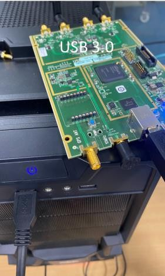

# IOS-MCN RAN DEVELOPER GUIDE

**TABLE OF CONTENTS:**

**1. INTRODUCTION**

- IOS-MCN RAN Developer Guide

**2. PURPOSE AND AUDIENCE**

**3. USRP Build Guide**

-   Prerequisites

-   HD Installation

-   Downloading the gNB source packages & Build

-   Output Artifacts

**4. 7.2 Split Build Guide**

-   Environment Setup

-   DPDK Installation

-   PHY & FH Library Build

-   Final Artifacts

**5. Dockerized RAN Build**

-   Dockerfile Structure

-   Image Build Steps


**6. Related Artifacts & links**
 


# I. INTRODUCTION

This document provides details on the structure of all the modules and features of the package, focused on the Radio Access Network portion. The following links are compiled from the original documents and use cases on which the IOS-MCN code is built.
                                    

# II. PURPOSE AND AUDIENCE

This document is intended only for the core developers of the 5G platform.

This guide briefly describes the build process for building the artifact for USRP. It covers system prerequisites, build process, and dependent software requirements.
                                    

# III. USRP BUILD GUIDE

The following commands will install all the tools and other things that are required for the build environment.
Note: The USRP Device must be connected to the build server on USB port 3.0.
```
bash
sudo apt install -y libboost-all-dev libusb-1.0-0-dev doxygen python3- docutils  python3- mako python3-numpy python3-requests python3- ruamel.yaml python3-setuptools cmake build-essential  

```


**Figure 1:** USB 3.0-based RF Interface Board connected to host system for PHY layer signal processing and synchronization in 5G RAN setup.

After this, we need to clone the source UHD driver code from GitHub.

```
git clone https://github.com/EttusResearch/uhd.git ~/uhd
```
```
cd ~/uhd
```
```

git checkout UHD-4.2
```
```
bash
cd host
```
```

mkdir build
```
```

cd build
```
```

cmake ../
```
```

make -j (nproc)
```
```

make test # This step is optional

```
```

sudo make install
```
```

sudo ldconfig
```
```

sudo uhd_images_downloader
```
---
### UNTAR IOSMCN-RAN gNB:


**Download the official source package for gNB:**

Step 1: Create a directory for IOSMCN-RAN-Source in home directory.

```
mkdir IOSMCN-RAN-Source
cd IOSMCN-RAN-Source
```

Step 2: Download the source code tar file.

```
wget https://github.com/ios-mcn/ios-mcn-releases/tree/main/Agartala/v0.2.0/RAN/source-code/iosmcn.agartala.v0.2.0.RAN.source.tar
```

Step 3: Untar the iosmcn.agartala.v0.2.0.ran.source.tar

```
tar -xvf iosmcn.agartala.v0.2.0.ran.source.tar
cd iosmcn.agartala.v0.2.0.RAN.source.tar

tar -xvzf openairinterface5g-0.2.0.openairinterface5g.tar.gz
cd openairinterface5g-0.2.0.openairinterface5g
```

Building gNB for USRP:
--

You can now proceed with building 5G(nr-softmodem) binary. Run the following commands in the cloned ran directory.
```
bash
source ./oaienv
```
```
bash
./cmake_targets/build_oai -w USRP --gNB --ninja --build-lib telnetsrv
```
Artifact for the build will be found at **( ~/cmake_targets/ran_build/build/nr-softmodem)** The final artifact includes the shared libraries built along with nr-softmodem and the    libxran library. Here are the names of the libraries.


| Library File              |                               |
|---------------------------|-------------------------------|
| libparams_libconfig.so    |                               |
| libcoding.so              |                               |
| libparams_yaml.so         |                               |
| libdfts.so                |                               |
| libldpc_orig.so           |                               |
| libldpc.so                |                               |
| libldpc_optim8seg.so      |                               |
| libldpc_optim.so          |                               |
| librfsimulator.so         |                               |
| liboai_usrpdevif.so       |                               |
| liboai_device.so          |  --> liboai_usrpdevif.so      |                                                       
-----------


**Figure 2:** Compiled IOSMCN-RAN 5G RAN and PHY libraries, including core, PHY, MAC, LDPC, and fronthaul components.

# IV. 7.2 SPLIT

This guide briefly describes the build process for building the artifact for 7.2 split RAN artifacts. It covers system prerequisites, build process and dependent software requirements.

---
## Pre-requisites:

Following commands will install all the tools and other things which are required for the build environment.

```
sudo apt update && sudo apt upgrade
```
Verify the kernel version (uname -r) currently we are using (5.15.07-1071-realtime)

## BUILD STEPS:

### DPDK (Data Plane Development kit):

```

sudo apt install wget xz-utils libnuma-dev
```
```
sudo apt install meson
```
```

wget http://fast.dpdk.org/rel/dpdk-20.11.9.tar.xz
```
### DPDK Compilation:
```

tar -xvf dpdk-20.11.9.tar.xz
```
```

cd dpdk-stable-20.11.9/
```
```

meson build
```
```

ninja -C build
```
```

sudo ninja install -C build
```
```

cd ../
```

Verify the installation is complete. 

**Given below is an example output for the linked libraries the version for the following will depend on the kernel version and dpdk complied.**

**SAMPLE OUTPUT FOR LINKED LIBRARIES:**

```
sudo ldconfig -v | grep rte
```

| Symlink                                   | Points To                                |
|-------------------------------------------|-------------------------------------------|
| librte_fib.so.0.200.2                     | librte_fib.so.0.200.2                     |
| librte_telemetry.so.0.200.2              | librte_telemetry.so.0.200.2              |
| librte_compressdev.so.0.200.2            | librte_compressdev.so.0.200.2            |
| librte_gro.so.20.0                       | librte_gro.so.20.0.2                      |
| librte_mempool_dpaa.so.20.0              | librte_mempool_dpaa.so.20.0.2             |
| librte_distributor.so.20.0               | librte_distributor.so.20.0.2              |
| librte_rawdev_dpaa2_cmdif.so.20.0        | librte_rawdev_dpaa2_cmdif.so.20.0.2       |
| librte_mempool.so.20.0                   | librte_mempool.so.20.0.2                  |
| librte_pmd_octeontx2_crypto.so.20.0      | librte_pmd_octeontx2_crypto.so.20.0.2     |
| librte_common_cpt.so.20.0                | librte_common_cpt.so.20.0.2               |
--------


### Building IOSMCN-RAN gNB for FHI-7.2:


**CLONE PHY(CHECKOUT oran_e_release_v1.0 ):**

```
git clone https://gerrit.o-ran-sc.org/r/o-du/phy.git ~/phy
```
```
cd ~/phy
```
```
git checkout oran_e_maintenance_release_v1.0
```
**Apply patches  (available in openairinterface5g-0.2.0.openairinterface5g/cmake_targets/tools/oran_fhi_integration_patches/E)**

```
git apply openairinterface5g-0.2.0.openairinterface5g/cmake_targets/tools/oran_fhi_integration_patches/E/oaioran_E.patch
```
```
cd ~/phy/fhi_lib/lib
```
```
export RTE_SDK=( Complete path to dpdk )/dpdk-stable-20.11.9/
```
```
export XRAN_DIR=( complete path to phy )/phy/fhi_lib
```
```
export WIRELESS_SDK_TOOLCHAIN=gcc
```
```

make XRAN_LIB_SO=1
```

After this step please check The shared library object:

**~/phy/fhi_lib/lib/build/libxran** so must be present before proceeding, **./build/libxran**.


You can now proceed building IOSMCN-RAN. You build it the same way as for other radios, providing option **-t oran_fhlib_5g**
Additionally, you need to provide it the location of the FH library: **--cmake-opt -Dxran_LOCATION=PATH**. 


```
cd ~/IOSMCN-RAN-Source/iosmcn.agartala.v0.2.0.RAN.source.tar/openairinterface5g-0.2.0.openairinterface5g/cmake_targets
```

```
export PKG_CONFIG_PATH=$PKG_CONFIG_PATH:/usr/local/lib64/pkgconfig/
```

**If you are installing IOSMCN-RAN for the first time, use the command below**

```

./build_oai -I 
```


```
sudo ./build_oai --gNB --ninja --build-lib telnetsrv -t oran_fhlib_5g --cmake-opt -DOAI_FHI72_USE_POLLING=ON --cmake-opt -DUNI_RAN=ON --cmake-opt -Dxran_LOCATION=(complete path to phy)/fhi_lib/lib
```

Artifact for the build will be found at **( ~/IOSMCN-RAN-Source/iosmcn.agartala.v0.2.0.RAN.source.tar/openairinterface5g-0.2.0.openairinterface5g/cmake_targets/ran_build/build/nr-softmodem)** The final artifact includes the shared libaries build along with nr-softmodem and the libxran library. Here are the details for the libraries.


**Shared library object after build success build the final package will have these shared objects which is for USRP as well as 7.2 split.**

| File / Library                     | File / Library                     | Notes                                 |
|-----------------------------------|------------------------------------|----------------------------------------|
| libcoding.so                      | liboai_usrpdevif.so                |                                        |
| libdfts.so                        | libparams_libconfig.so             |                                        |
| libldpc_optim8seg.so              | librfsimulator.so                  |                                        |
| libldpc_optim.so                  | nr-cuup                            |                                        |
| libldpc_orig.so                   | nr-softmodem                       |                                        |
| libldpc.so                        | libparams_yaml.so                  |                                        |
| liboai_device.so                  | liboai_usrpdevif.so                |                                        |
| libtelnetsrv_5Gue.so              |                                    |                                        |
| libtelnetsrv_bearer.so            | libtelnetsrv_rrc.so                |                                        |
| libtelnetsrv_ci.so                | libtelnetsrv.so                    |                                        |
| libtelnetsrv_ciUE.so              | liboai_transpro.so                 | → liboran_fhlib_5g.so                  |
| libtelnetsrv_enb.so               | macpdu2wireshark                   |                                        |
| libtelnetsrv_o1.so                | T_message.txt                      |                                        |
| libxran.so                        |                                    |                                        |
---

**Building macpdu2wireshark utility:**

This utility is required to capture the RRC packets. Follow the steps to build the utility:

```
cd ~/IOSMCN-RAN-Source/iosmcn.agartala.v0.2.0.RAN.source.tar/openairinterface5g-0.2.0.openairinterface5g/common/utils/T/tracer
```
```
make all
```
This utility also needs a database file (T_messages.txt) which is also the part of tar package. You can get that file from(~/IOSMCN-RAN-Source/iosmcn.agartala.v0.2.0.RAN.source.tar/openairinterface5g-0.2.0.openairinterface5g/common/utils/T).


# V. DOCKERIZED RAN BUILD GUIDE

This Guide is intended to use to build the docker images for the ran source package
**iosmcn.agartala.v0.2.0.ran.source.tar**

```
cd ~/IOSMCN-RAN-source/iosmcn.agartala.v0.2.0.RAN.source.tar/openairinterface5g-0.2.0.openairinterface5g/docker/**
```

**Follow the instructions in the README.md file present at this path[~/IOSMCN-RAN-source/iosmcn.agartala.v0.2.0.RAN.source.tar/openairinterface5g-0.2.0.openairinterface5g/docker/README.md]**


For all platforms, the strategy for building docker images is the same:

    - First we create a common shared image ran-base that contains: 

    - All the latest source files (by using the COPY function)

    - All the means to build an IOSMCN-RAN executable

    - All packages, compilers, ...especially UHD is installed

    - Then, from the ran-base shared image, we create a shared image ran-build into which all targets are compiled.

-   Then from the ran-build shared image, we can build target images for:

    -  gNB/DU (with UHD)  contain:

    - the generated executable (for example lte-softmodem)

    -   the generated shared libraries (for example liboai_usrpdevif.so)

    - the needed libraries and packages to run these generated binaries

    - Some configuration file templates
    - Some tools (such as ping, ifconfig) 
    - From the ran-build-fhi72 image, we can build target image for:
    - gNB/DU (with FHI 7.2)
      
### PREREQUISITES:

-   git installed
-   docker-ce installed
-   Pulling ubuntu:jammy from DockerHub

### STEPS TO BUILD SHARED IMAGES:
   As discussed above to generate a build we had divided the Docker files into three stages 
   
-   Dockerfile.base.ubuntu22.iosmcn 
-   Dockerfile.build.ubuntu22.iosmcn
-   Dockerfile.gNB.ubuntu22.iosmcn 
 


As you start the build process , you will see the final build packages (i.e. images) in the final stage and in the GUI packages tab you will see the final image.


**The images shown below is for reference only:**


# VI. Related Artifacts & links

This section contains list of related documents to the UNI RAN PROJECT. 

| Document Name       | Purpose | Link  |
|---------------------|---------|-------|
| Integration Guide   |  To integrate the gNB with Radio unit and Core|https://github.com/ios-mcn/ios-mcn-releases/tree/main/Agartala/v0.2.0/RAN/documentation/RAN-UNI/IOS-MCN%20RAN-UNI%20Integration%20Guide.md |
|User Guide    | To use RAN-UNI with test environment       | https://github.com/ios-mcn/ios-mcn-releases/tree/main/Agartala/v0.2.0/RAN/documentation/RAN-UNI/IOS-MCN%20RAN-UNI%20USER_GUIDE.md       |
|Installation Guide  |  To install the UNI RAN environment    |https://github.com/ios-mcn/ios-mcn-releases/tree/main/Agartala/v0.2.0/RAN/documentation/RAN-UNI/IOS-MCN%20RAN-UNI%20INSTALLATION_GUIDE.md    |
|Troubleshooting Guide|To help the user troubleshoot issues         | https://github.com/ios-mcn/ios-mcn-releases/tree/main/Agartala/v0.2.0/RAN/documentation/RAN-UNI/IOS-MCN%20RAN-UNI%20TROUBLESHOOTING_GUIDE.md   |


  Any specific support on IOSMCN-RAN, please raise issues at IOS-MCN Releases
