.. This work is licensed under a Creative Commons Attribution 4.0 International License.
.. SPDX-License-Identifier: CC-BY-4.0

DARPAN-M: IOS-MCN Unified Dashboard
===================================

**The SMO Layer (Service Management & Orchestration) for IOS-MCN
Project**

Features

- Core Network Function Management and Monitoring

- Core Fault Monitoring and Notification

- AMF & SMF Real Time Statistics with History Dashboards

- User Equipment/Subscriber Management

- Device Group Management

- Network Slice Management

- Performance and Metrics Monitoring

- Deployment Management

- Infrastructure Resource Utilization Dashboards

- RAN Inventory Management and Monitoring

- RAN Fault Monitoring and Notification

- User and Credential Administration

- Dashboards

Home Dashboard – Core Bitrate & Traffic Monitoring
--------------------------------------------------

|image1|

**Core - AMF Overview**
------------------------

|image2|

**Core - SMF Overview**
-----------------------

|image3|

**Core - System Overview**
--------------------------------------------------

|image4|

**Core - Network Function Management**
--------------------------------------------------

|image5|

**Core – NF Configuration Management**
--------------------------------------------------

|image6|

**Core – NF Configuration Management**
--------------------------------------------------

|image7|

**Core Fault Monitoring**
--------------------------------------------------

|image8|

**Fault Notification**
--------------------------------------------------

|image9|

**User Equipment/Subscriber Management**
--------------------------------------------------

**List:**
--------------------------------------------------

|image10|

**Add New:**
--------------------------------------------------

|image11|

**Edit/Update:**
--------------------------------------------------

|image12|\ **
**

**Device Group Management**
--------------------------------------------------

**List:**
--------------------------------------------------

|image13|

**Add New:**
--------------------------------------------------

|image14|

**Edit/Update:**
--------------------------------------------------

|image15|

**Network Slice Management**
--------------------------------------------------

**List:**
--------------------------------------------------

|image16|

**Add New:**
--------------------------------------------------

|image17|

**Edit/Update:**
--------------------------------------------------

|image18|

**RAN Management - Overview**
--------------------------------------------------

|image19|

** RAN – SMO Overview** 
--------------------------------------------------

|image20|

**RAN – Inventory**
--------------------------------------------------
|image21|

|image22|

**RAN – Configuration Listing**
--------------------------------------------------

|image23|

|image24|

**RAN – Fault Monitoring**
--------------------------------------------------

|image25|

**Deployment Management – Core**
--------------------------------------------------

|image26|

**Infrastructure – RAN SMO**
--------------------------------------------------

|image27|

**Administration – User Management**
--------------------------------------------------

|image28|

**Administration – Credential Management**
--------------------------------------------------

|image29|

**Administration – Settings**
--------------------------------------------------
|image30|

.. |image1| image:: ./images/udb/image2.png
   :width: 7.80019in
   :height: 7.3125in
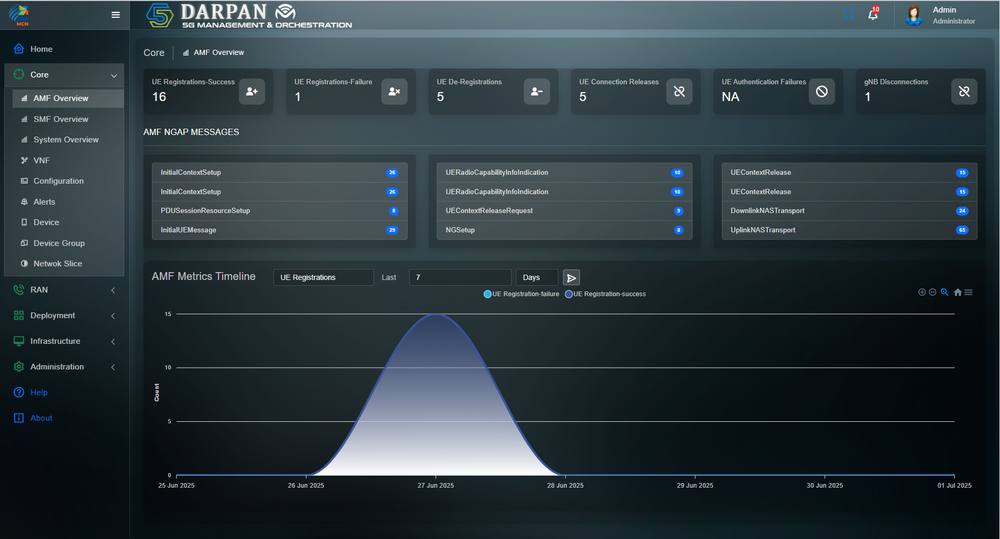
.. |image3| image:: ./images/udb/image4.png
   :width: 10.69306in
   :height: 5.63542in
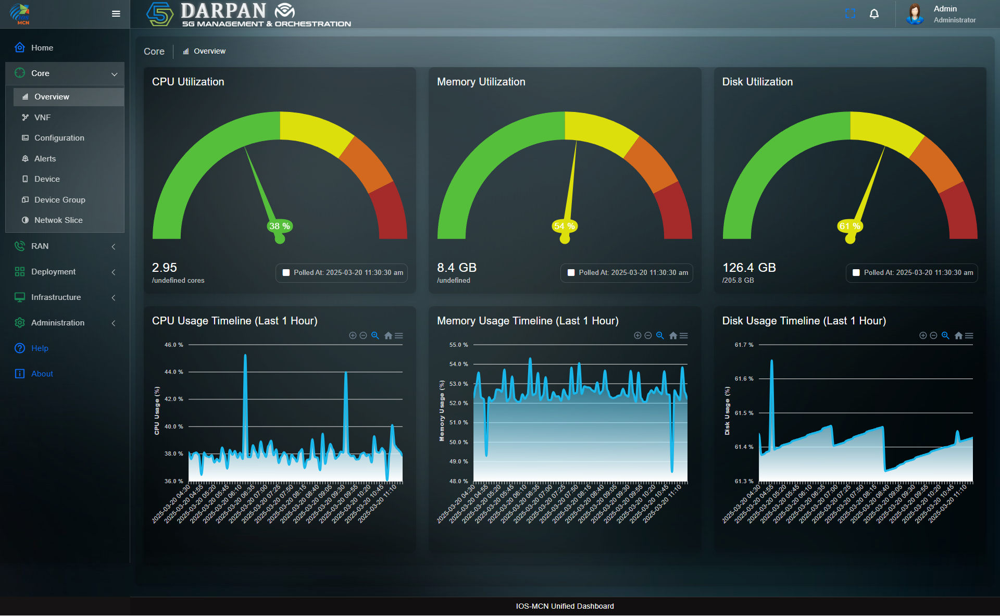
.. |image5| image:: ./images/udb/image6.png
   :width: 10.69306in
   :height: 6.07639in
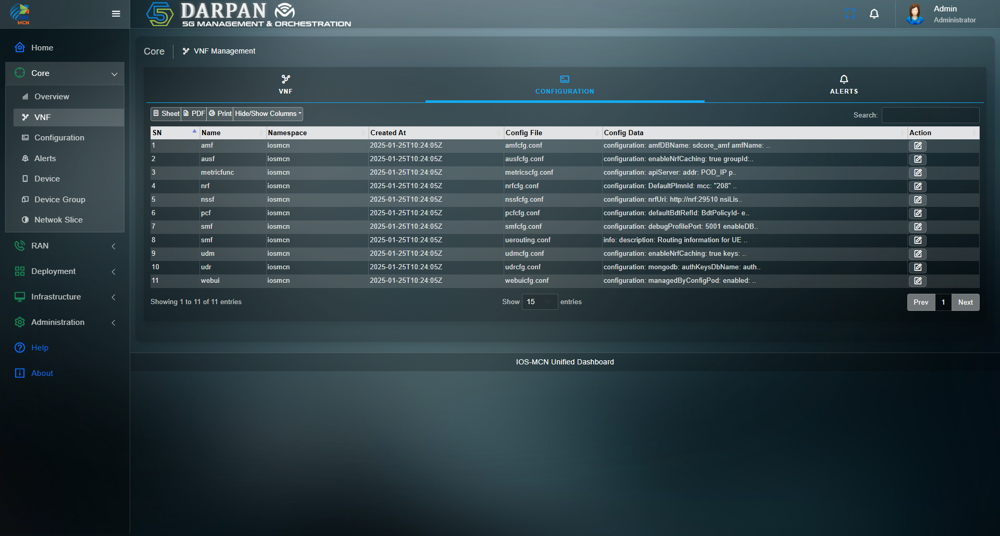
.. |image7| image:: ./images/udb/image8.png
   :width: 10.69306in
   :height: 5.74167in
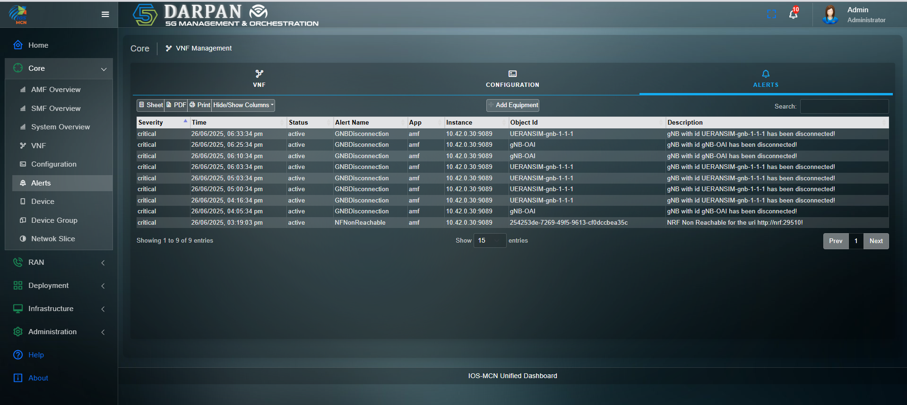
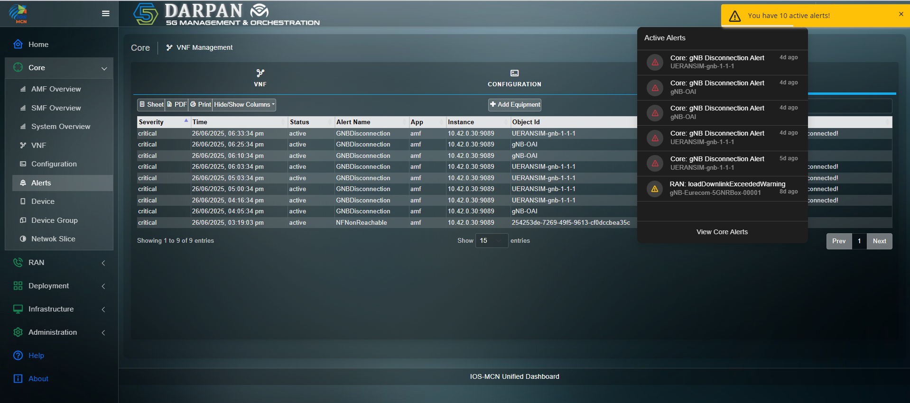
.. |image10| image:: ./images/udb/image11.png
   :width: 10.69306in
   :height: 6.07639in
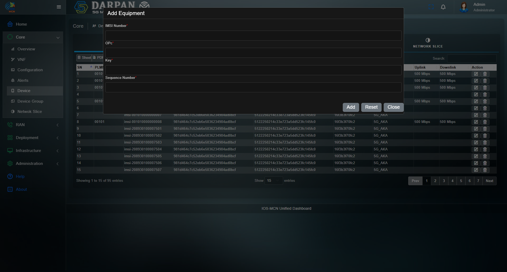
.. |image12| image:: ./images/udb/image13.png
   :width: 10.69306in
   :height: 5.74167in
.. |image13| image:: ./images/udb/image14.png
   :width: 10.69306in
   :height: 5.74167in
.. |image14| image:: ./images/udb/image15.png
   :width: 10.69306in
   :height: 5.74167in
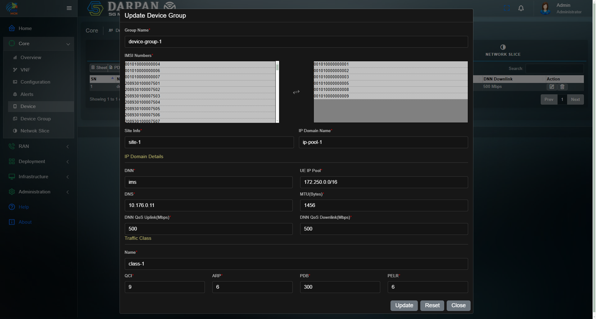
.. |image16| image:: ./images/udb/image17.png
   :width: 10.69306in
   :height: 5.74167in
.. |image17| image:: ./images/udb/image18.png
   :width: 10.69306in
   :height: 5.74167in
.. |image18| image:: ./images/udb/image19.png
   :width: 10.69306in
   :height: 5.74167in
.. |image19| image:: ./images/udb/image20.png
   :width: 10.69306in
   :height: 5.74167in
.. |image20| image:: ./images/udb/image21.png
   :width: 10.57011in
   :height: 7.34375in
.. |image21| image:: ./images/udb/image22.png
   :width: 10.69306in
   :height: 5.74167in
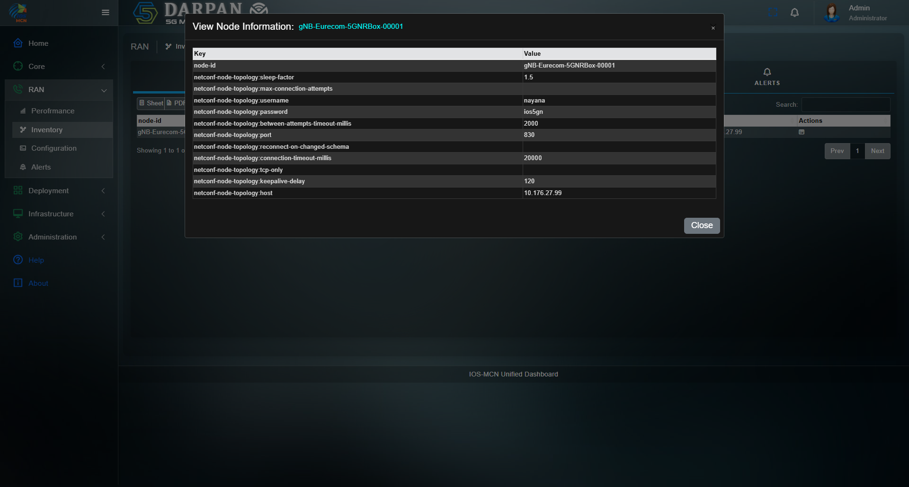
.. |image23| image:: ./images/udb/image24.png
   :width: 10.69306in
   :height: 5.74167in
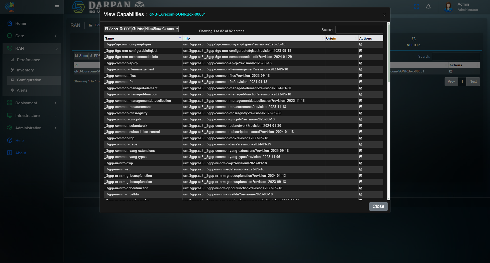
.. |image25| image:: ./images/udb/image26.png
   :width: 10.69306in
   :height: 5.74167in
.. |image26| image:: ./images/udb/image27.png
   :width: 10.69306in
   :height: 5.74167in
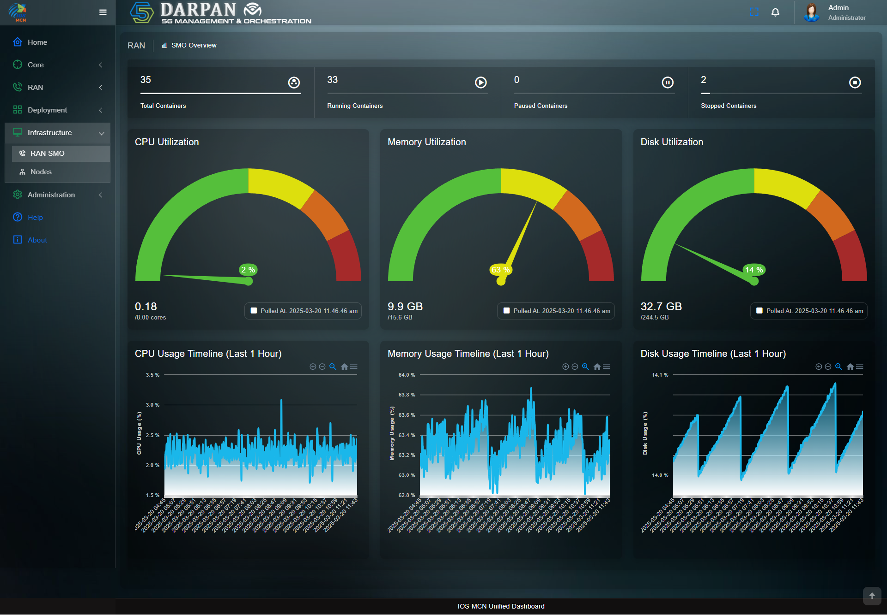
.. |image28| image:: ./images/udb/image29.png
   :width: 10.69306in
   :height: 5.74167in
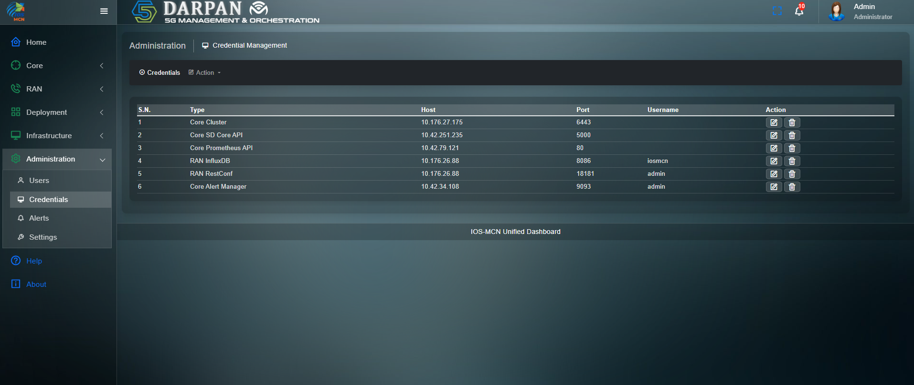
.. |image30| image:: ./images/udb/image31.png
   :width: 10.69306in
   :height: 5.74167in
