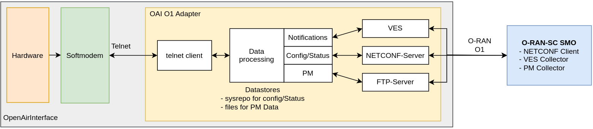

# User guide
This guide describes how to deploy and run the various components of the IOS-MCN-RAN project. All build artifacts are generated under the build directory inside the main **ios-mcn-ran** directory. Refer to the [Installation Guide](./IOS-MCN%20RAN-DIS%20Installation-guide.md) for steps to build and install the RAN.
```
cd ios-mcn-ran
```
The following are the commands to run CU-CP, CU-UP and DU,
- [Run CU-CP](#run-cu-cp)
- [Run CU-UP](#run-cu-up)
- [Run DU](#run-du)
  - [Split 8](#split-8)
  - [Split 7.2](#split-72)
- [XN Handover](#xn-handover)
- [Run UE with RFSIM](#run-ue-with-rfsim)
- [COTS UE usage](#cots-ue-usage)
- [Including RIC interfaces O1 and/or E2](#including-ric-interfaces-o1-andor-e2)
- [Run with RU M plane](#run-with-ru-m-plane)


## Run CU-CP:
To start the Central Unit - Control Plane(CU-CP):
```
sudo nr-softmodem -O ./conf/gnb-cucp.sa.f1-e1.iisc.conf 
```
Configuration details can be customized in the above ``.conf`` file. Modify the ``plmn_list``, ``amf_ip_address``, ``GNB_IPV4_ADDRESS_FOR_NG_AMF`` and ``tracking_area_code`` according to your deployment.

If the deployment includes ios-mcn-core, you can retrieve the IP addresses of the AMF and UPF by logging into the core system and executing the following commands:
```bash
# List the services in the core network and note the Cluster IP of the AMF
kubectl get svc -n iosmcn

# Display the IP address of the UPF interface(access) connected to the access network
ip a show access
```

## Run CU-UP:
To start the Central Unit - User Plane (CU-UP):
```
sudo nr-cuup -O ./conf/gnb-cuup.sa.f1-e1.iisc.conf
```
This guide assumes that the CU-CP, CU-UP, and DU components are deployed on a single server. If they are deployed on separate servers, make sure to update the IP addresses for ``ipv4_cucp``, ``ipv4_cuup``, ``local_s_address``, and ``remote_s_address`` in their respective configuration files to reflect the correct network setup.
## Run DU:
The Distributed Unit (DU) can be launched in two main configurations:

1. Split 8 setups are typically used with SDRs like USRP, where the PHY resides on the DU machine.
2. In Split 7.2, the L1 PHY is split up, and Fronthaul communication is handled over e-CPRI (Ethernet using a dedicated PHY interface library).

 
<br>
### Split 8
In split 8 depending on the requirements, simulate the RF channel by running the DU in RFSIM mode (If no radio is available) or with a USRP radio to radiate over the air. 
Depending on the radio either a B210 or an X310 configuration file can be used
```bash
# For B210
sudo nr-softmodem -O ./conf/gnb-du.sa.band78.106PRB.1x1-f1-e1-usrpb210.conf

# For X310
sudo nr-softmodem -O ./conf/gnb-du.sa.band78.106PRB.1x1-f1-e1-usrpx310.conf
```
To run with RF simulator one can use the argument ``--rfsim``

```
sudo nr-softmodem -O ./conf/gnb-du.sa.band78.106PRB.rfsim.conf --rfsim --gNBs.[0].min_rxtxtime 6
```
### Split 7.2
⚠️To run in split 7.2 configuration, with Lekha or a VVDN radios, 
the following pre-requirsites are needed to be completed. [Prerequisites](./IOS-MCN%20RAN-DIS%20ORAN-FHI7.2-Tutorial.md)
```
sudo nr-softmodem -O ./conf/gnb-du.sa.band78.273PRB.1x1-f1-e1-lekha.iisc.conf --thread-pool 12,14 --telnetsrv --telnetsrv.shrmod o1
```

## Run UE with RFSIM:
To run UE with RFSIM to connect with DU, one can run UE with the following command, the center frequency and other parameters should be changed according to the setup. Refer the following for more [details](./IOS-MCN%20RAN-DIS%20RUNUEMODEM.md).
```
sudo nr-uesoftmodem -O ./conf/ue.sa.conf -C 3619200000 -r 106 --ssb 512 --numerology 1 --rfsimulator.serveraddr 127.0.0.1
```

## COTS UE usage
The following are the list of UEs that are tested in our lab.
|UE         | model and chipset                                                                    |
|-----------|--------------------------------------------------------------------------------------|	 
|1	        |OnePlus Nord CE 3 Lite 5G(CPH2467)	Qualcomm Snapdragon 695 5G Octa Core               |
|2	        |Samsung Galaxy A15 5G(SM-A156E/DS)	MediaTek Dimensity 6100+                           |
|3	        |Lava Blaze 5G(LAVA LXX503)	MediaTek Dimensity 700                                     |
|4	        |OnePlus Nord CE 4 Lite 5G(CPH2619)	Qualcomm Snapdragon 695 5G Octa Core               |
|5	        |Oppo F23 5G(CPH2527)	Qualcomm Snapdragon 888 Octa Core                              |
|6	        |OnePlus Nord CE4(CPH2613)	Qualcomm Snapdragon 7 Gen 3                                |
|7	        |Oneplus 9 5G	Qualcomm Snapdragon 888 Octa Core                                      |
|8	        |Oppo F23 5G(CPH2527)	Qualcomm Snapdragon 888 Octa Core                              |
|9	        |Optimus Rhino 5G	MediaTek Dimensity 900 octa-core                                   |
|10	        |Oneplus Nord CE3 5G	Qualcomm Snapdragon 782G  Octa Core                            |
|11	        |Samsung Galaxy A14 5G	Exynos 1330 Octa Core                                          |
|12	        |Samsung Galaxy M15 5G	MediaTek Dimensity 6100+                                       |
|13	        |Oppo A3 Pro 5G 	MediaTek Dimensity 6300                                            |
|14	        |Vivo T3x 5G	Qualcomm Snapdragon 6 Gen 1                                            |
|15	        |Realme p2 Pro 5G 	Qualcomm Snapdragon 7 Gen 2                                        |
|16	        |Moto G85 5G	Qualcomm Snapdragon 6s Gen3                                            |
|17	        |Moto G35 5G	Unisoc T760 Octa Core                                                  |
|18	        |Oppo F27 5G 	MediaTek Dimensity 6300                                                |
|19	        |Lava Agni 2(LAVA LXX504) 	MediaTek Dimensity 7050                                    |

COTS UEs (with programmable SIMs from OpenCells) are used for integration testing.
### SIM Card
Program UICC/SIM Card with [Open Cells Project](https://open-cells.com/) programming tool [uicc-v3.3](https://open-cells.com/d5138782a8739209ec5760865b1e53b0/uicc-v3.3.tgz).

```bash
# Download the SIM programmer tool
wget https://open-cells.com/d5138782a8739209ec5760865b1e53b0/uicc-v3.3.tgz

# Unzip the zip file
tar -xvf uicc-v3.3.tgz

# Navigate to the unzipped directory
cd uicc-v3.3

# Build the programmer
make 

# Connect the USB with the programmable SIM and program the SIM with the following command
sudo ./program_uicc --adm 12345678 --imsi 001010000000001 --isdn 00000001 --acc 0001 --key fec86ba6eb707ed08905757b1bb44b8f --opc C42449363BBAD02B66D16BC975D77CC1 -spn "IOSMCN" --authenticate

# To check if the SIM is programmed run
sudo ./program_uicc
# ..and check if the IMSI matches with the one in the earlier command.
```
>⚠️**NOTE:** Use Netmonster or similar tools to configure the phone preferred network type to NR only, to be able to detect and connect to 5G network.

## **Xn Handover**

An Xn handover involves the transfer of a UE from one gNB to another gNB, where both the gNBs are connected to the same 5G core network. In F1 handover, the CU handles the process internally between its DUs and in N2 handover requires signaling through the AMF. In Xn Handover, signaling happens between CUCPs via Xn-C.

We assume:
* Two independent gNBs connected to the same 5GC.
* A UE is initially connected to a gNB with PCI 0, and which will be handed over to an another gNB with PCI 1.
* Handover is triggered either by a decision based on measurement event (e.g. A3) or by a telnet command.

### XNAP section in the CUCP configuration
 
```bash
    XNAP :
    {
         ENABLE_XN = 1;
         GNB_PORT_FOR_XNC            = 38423;
         GNB_IP_ADDRESS_FOR_XNC      = "10.32.14.191"; // <local_system_ip> 
         Target_gNB_XN_address       = ({ ip = "10.32.14.192";});
    }
```
Make sure to add the above XNAP config inside the gNBs section of the CUCP configuration fie. You can also disable Xn by making `ENABLE_XN=0` below `E1_INTERFACE` section in the same CUCP configuration file.

### Neighbour section
In order to enable handovers (triggered by the UE), you have to configure the neighbour relation of the DUs at the CU. To do so, proceed as follows:

1. To simplify filling the right values in the neighbour configuration, you can rely on the information the CU has about both DUs. Start the CU and both DUs. Navigate to the directory from which you started the CU, and print RRC statistics:
   ```
   cat nrRRC_stats.log
   ```
1. Fill in the [`neighbour-config.conf`](../conf_files/neighbour-config.conf) configuration file as shown below, and
   `@include` it in the CUCP file.
1. Start both gNBs.
1. Bring the phone close to one cell, and leave flight mode. It should connect to the gNB to which it is closer.
1. Move the UE towards the other gNB; it should trigger an "A3 event" (Neighbour Becomes Better than Serving), and the CUCP will trigger the handover to the other gNB.

```
neighbour_list = (
  {
    nr_cellid = 12345678;
    neighbour_cell_configuration = (
      {
        gNB_ID = 0xe01;
        nr_cellid = 11111111;
        physical_cellId = 1;
        absoluteFrequencySSB = 643296;
        subcarrierSpacing = 1; #30 KHz
        band = 78;
        plmn = { mcc = 001; mnc = 01; mnc_length = 2};
        tracking_area_code = 1;
      }
    )
  },
  {
    nr_cellid = 11111111;
    neighbour_cell_configuration = (
      {
        gNB_ID = 0xe00;
        nr_cellid = 12345678;
        physical_cellId = 0;
        absoluteFrequencySSB = 643296;
        subcarrierSpacing = 1; #30 KHz
        band = 78;
        plmn = { mcc = 001; mnc = 01; mnc_length = 2};
        tracking_area_code = 1;
      }
    )
  }
 );
nr_measurement_configuration = {
  Periodical = {
    enable = 1;
    includeBeamMeasurements = 1;
    maxNrofRS_IndexesToReport = 4;
  };
  A2 = {
    enable = 1;
    threshold = 60;
    timeToTrigger = 1;
  };
  A3 = ({
    cell_id = -1; #Default
    offset = 10;
    hysteresis = 0;
    timeToTrigger = 1
  })
};
```
The configuration below further enables periodic measurements, A2 event ("Serving becomes worse than threshold"), and A3 events ("Neighbour Becomes Better than Serving by an offset"). The A2 event can be disabled by setting `enable = 0`. A3 events cannot be disabled as of now. Further, the A3 events can be made specific to cells; `cell_id = -1` means "any cell".

`@include` this configuration file inside the gNB section of CUCP file as shown below.
```
    plmn_list = ({ mcc = 001; mnc = 01; mnc_length = 2; snssaiList = ({ sst = 1, sd = 0x000000 })});
    @include "neighbour-config.conf"
```
### Bringing up the setup

#### Steps to run Xn Handover with COTS UE.

1. Bring up the 5G core network.
2. Run the gNBs having XNAP enabled and neighbour section included in the CUCP configuration.
3. Connect UE to any of the gNBs.
4. As you move towards the other gNB A3 Events get triggered. And CUCP will handover the UE context to target gNB.

#### Steps to run Xn Handover with [nrUE with RUsim](## Run UE with RFSIM:)

1. Bring up the 5G core network.
2. Make sure you build the gNB with telnet [as shown here](### **Build with telnet support**).
   And gNBs having XNAP enabled and neighbour section included in the CUCP configuration.
3. Bring up gNBs using commands from [section](# User guide). Just append `--telnetsrv --telnetsrv.shrmod ci` to CUCP command.
```bash
sudo ./nr-softmodem -O <cucp_conf_having_XNAP_and_neighbour_configuration_included> --sa --telnetsrv --telnetsrv.shrmod ci
```
4. To trigger HO from source gNB to target gNB, use the following commands
```bash
cd ios-mcn-ran/openairinterface5g/
echo ci trigger_xn_ho [cu-ue-id] | nc 127.0.0.1 9090 && echo
```

> **Note**
> You can use the telnet command with COTS UE as well. For that, follow the below steps.
> Make sure you build the gNB with telnet [as shown here](### **Build with telnet support**). 
> Append `--telnetsrv --telnetsrv.shrmod ci` to CUCP command while bringing up the gNBs.
> Use telnet command as shown above to trigger handover.

## **Cell Reselection**

Cell reselection in 5G is the process where a mobile device (UE) in idle mode autonomously switches to a new, better-quality serving cell to maintain a strong and reliable connection.
In the current implementation, only the basic code is available. We are manually moving the UE to `RRC_IDLE` mode. Then, after some time (~10s), UE reselects the gNB with the better signal.

### steps to perform cell reselection

1. Bring up the 5G core network.
2. Make sure you build the gNB with telnet [as shown here](### **Build with telnet support**).
3. Append `--telnetsrv --telnetsrv.shrmod rrc` to CUCP command while bringing up gNBs.  
4. To make the UE perform cell reselection, use the command below to move the UE to RRC_IDLE mode

``` bash
cd ios-mcn-ran/openairinterface5g/
echo rrc release_rrc <CU_UE_ID>| nc 127.0.0.1 9090 && echo
```

## Containerized deployment

The deployment is as easy as modifying the .env file, and configuration files according to the deployment, in the .env file configure the ```REPOSITORY=ios-mcn``` and ```VERSION=v0.3.0```
```bash
cd ios-mcn-ran/cicd/5g_sa_b200_40MHz/
# Modify the .env file with the Organization and Image version.
vi .env

# Go back to ios-mcn-ran/conf
cd ios-mcn-ran/conf/
# Modify the CU-CP configuration file with PLMN and AMF IP address.
vi gnb-cucp.sa.f1-e1.iisc.conf
vi gnb-cuup.sa.f1-e1.iisc.conf

# The DU configuration file can be modified with the required frequency and bandwidth.
vi gnb-du.sa.band78.106PRB.1x1-f1-e1-usrpb210.conf
```

To bring up the container run ```docker-compose up -d```. </br>
```bash
cd ios-mcn-ran/cicd/5g_sa_b200_40MHz/
docker-compose up -d
```

To bring down the container run ```docker-compose down```.</br>
```bash
cd ios-mcn-ran/cicd/5g_sa_b200_40MHz/
docker-compose down
```

To check the status of the containers run ```docker ps -a```.
```bash
docker ps -a
```

The container logs can be checked using the command ```docker logs -f <contaienr_name>```.</br>
```bash
# Example
docker logs -f ios-mcn-cucp
```

# Advanced deployment
## Including RIC interfaces O1 and/or E2.
IOS-MCN-RAN supports integration with SMO and RIC:
### O1-adapter
O1-adapter is used for setting up an O1 interface for the RAN components, O1-adapter connects to the RAN components using the telent interface. Documentation for the telnet interface in the RAN. [telnet-o1](https://gitlab.eurecom.fr/oai/openairinterface5g/-/blob/develop/common/utils/telnetsrv/DOC/telneto1.md)
Documentation to setup the O1 interface to the RAN. [Documentation](https://gitlab.eurecom.fr/oai/o1-adapter)



### Run o1-adapter with DU
On the **DU** side, enable the Telnet server to allow O1-adapter communication.  
Use the following parameters:
- `--telnetsrv` — enables the Telnet server  
- `--telnetsrv.shrmod o1` — loads the O1 shared module  
- `--telnetsrv.listenport <port-number>` — sets the Telnet port (default: `9090`)
```
sudo nr-softmodem -O ./conf/gnb-du.sa.band78.273PRB.1x1-f1-e1-lekha.iisc.conf --thread-pool 12,14 --telnetsrv --telnetsrv.shrmod o1 --telnetsrv.listenport 9090
```
On the o1-adapter side.
```bash
cd cicd/5g_fh72_tdd_100MHz/

# Modify the additional paramters to --du (command: ["--du", "-c", "/docker/config/du_config.json"])
# Modify the Netconf port and sftp port as per the requirement 
vi docker-compose-o1.yaml

docker-compose -f docker-compose-o1.yaml up -d
```
### Run with RU M plane

M plane allows to setup, configure and get performance metrics from the RUs, this has been tested with the following RUs
- Lekha MaRUt Low power radio unit
- VVDN LPRU

On the DU side to run with RU M plane use the configuration with ``-mplane.*.conf`` configuration file and ``--mplane`` parameter.
```
sudo nr-softmodem -O ./conf/gnb-du.sa.band78.273PRB.1x1-f1-e1-lekha.iisc.conf --thread-pool 12,14 --mplane
```

#### M plane section in the DU configuration file 

```bash
    fhi_72 = {
      dpdk_devices = ("0000:b1:01.0", "0000:b1:01.1");
      system_core = 2;
      io_core = 6;
      worker_cores = (4);
      du_addr = ("00:11:22:33:44:66", "00:11:22:33:44:66");
      ru_addr = ("98:ae:71:04:83:a3", "98:ae:71:04:83:a3");
      ru_ip_addr = ("192.168.4.42");
      du_key_pair = ("/home/nr5glab-server/.ssh/id_rsa.pub", "/home/nr5glab-server/.ssh/id_rsa");
      vlan_tag = (100, 100);
      mtu = 8870; # check if xran uses this properly
      fh_config = ({
        Tadv_cp_dl = 125;
        T2a_cp_dl = (285, 429); # (min, max)
        T2a_cp_ul = (285, 429); # (min, max)
        T2a_up = (125, 428); # (min, max)
        Ta3 = (130, 170); # (min, max)
        T1a_cp_dl = (285, 470); # (min, max)
        T1a_cp_ul = (285, 429); # (min, max)
        T1a_up = (125, 350); # (min, max)
        Ta4 = (110, 180); # (min, max)
        ru_config = {
          iq_width = 16;
          iq_width_prach = 16;
          fft_size = 12;
        };
        prach_config = {
          eAxC_offset = 1;
        };
      });
    };
```
Configure the fhi_72 section with `du_key_pair`, `ru_ip_address`, and `ru_username` inorder for the DU to connect with RU over M plane over SSH. The M plane supports the following startup functionality of connecting to the RU over call-home, setting the userplane configuration of the RU, checking and running based on the sync state of the RU, and getting the performance metrics of the RU. 

On the o1-adapter side too run with ``--mplane`` to use the paramters sent by the RAN with respect to M plane.
```
cd cicd/5g_fh72_tdd_100MHz/
docker-compose -f docker-compose-o1.yaml up -d
```
### E2 Agent
E2 interface for the RAN components is enabled by providing the e2 details in the configuration file. Documentation to setup E2 interface.[Documentaion](https://gitlab.eurecom.fr/oai/openairinterface5g/-/tree/develop/openair2/E2AP) <br>


For more details on development, Please refer the [Developers guide](./IOS-MCN%20RAN-DIS%20developer-guide.md). <br><br>
Troubleshooting guide shared for the issues faced. [Troubleshooting](./IOS-MCN%20RAN-DIS%20Troubleshooting-guide.md)