# **IOS-MCN RAN-UNI INSTALLATION GUIDE**

Introduction
======================

This document presents the architecture, installation, and configuration
of a private 5G RAN using open-source software, highlighting key
components, deployment strategies, and system optimization techniques.

Purpose and Audience
-----

This document provides a comprehensive guide for installing, configuring, and validating a 5G Radio Access Network (RAN) setup, including hardware preparation, BIOS tuning, firmware updates, software installation, and system-level validation.

It is intended for:

- **Telecom engineers and researchers deploying or testing Open RAN systems**

- **System integrators working with USRP hardware and L1/L2 software stacks**

- **Developers involved in 5G RAN optimization, DPDK, and real-time kernel tuning**

- **Operators and lab technicians preparing RAN testbeds for experimentation or validation**

The guide assumes basic familiarity with Linux systems, networking, and radio technologies.

# TABLE OF CONTENTS
>
>## LIST OF CONTENTS
>
>- LIST OF FIGURES  
>
>## CHAPTERS
>
>### 1. **INTRODUCTION**
>### 2. **BACKGROUND**
>- 2.1 **RAN ARCHITECTURE**  
>- 2.2 **HARDWARE & SOFTWARE REQUIREMENTS**
>### 3. **HARDWARE SETUP & BIOS CONFIGURATION**
>### 4. **FIRMWARE AND DRIVER INSTALLATION**
>- 4.1 **FIRMWARE UPDATE**
>### 5. **SOFTWARE INSTALLATION**
>- 5.1 **DPDK INSTALLATION**  
>- 5.2 **RAN PACKAGE**
>### 6. **RUNNING THE RAN APPLICATION**
>- 6.1 **USRP b210 CONFIGURATION**  
>- 6.2 **VVDN LPRU CONFIGURATION**
>- 6.3 **LEKHA MaRUT LPRU CONFIGURATION**
>### 7. **VERIFICATION & TESTING**
>### 8. **DOCKERIZED RAN GUIDE**
>- 8.1 **LOAD THE IMAGE**  
>- 8.2 **PREPARE THE HOST ENVIRONMENT**  
>- 8.3 **COMPOSE THE YAML FILE**  
>- 8.4 **RUN THE CONTAINER**
>### 9. **REFERENCES**
>
---


**LIST OF FIGURES**
--

>| **Figure No.** | **Description**                                                                 | 
>|----------------|----------------------------------------------------------------------------------|
>| Figure 1       | Device-level BIOS configuration for RAN optimization                            |         
>| Figure 2       | Extreme Memory Profile BIOS setting                                              |        
>| Figure 3       | BIOS setting showing VT-d enabled                                                |        
>| Figure 4       | SR-IOV output page showing enabled virtualization support                        |       
>| Figure 5       | Intel® Ethernet Network Adapter E810 details                                     |3       
>| Figure 6       | Extracted contents of the RAN software tar package                               | 
>| Figure 7       | Output of /proc/cmdline showing kernel boot parameters                           |
>| Figure 8       | Output of cpupower frequency-info for CPU frequency settings                     | 
>| Figure 9       | USRP B210 to gNB hardware connection diagram                                     | 
>| Figure 10      | Contents of the test.sh script for system initialization                         |
>| Figure 11      | Route creation output after running test.sh script                               |
>| Figure 12      | Running VF configuration script with user privileges                             |
>| Figure 13      | Details of vf.sh script for DPDK and VF setup                                    |
>| Figure 14      | Output of `ip link show` displaying virtual function interfaces                  |
>| Figure 15      | Script contents for slave PTP configuration (`slave-enp2s0fo.sh`)                |
>| Figure 16      | Output after executing slave PTP configuration script                            |
>| Figure 17      | Script contents for master PTP configuration (`master-enp2s0f1.sh`)              | 
>| Figure 18      | Output of master PTP script to sync LPRU via gNB                                 |
>| Figure 19      | Script for `phc2sys-master` to sync system and hardware clocks                   | 
>| Figure 20      | Output of `phc2sys-master` script                                                 | 
>| Figure 21      | Logging into LPRU terminal                                                       |
>| Figure 22      | LPRU synchronization confirmation in terminal                                    | 
>| Figure 23      | XML parser configuration script for LPRU (`e_2x2.xml`)                           | 
>| Figure 24      | Output after parsing LPRU configuration XML                                      |
>| Figure 25      | Memory register write command run in LPRU terminal                               |
>| Figure 26      | Screenshot of `sysrepocfg` editor showing ACTIVE status                          | 
>| Figure 27      | gNB registration log indicating RAN startup success                              | 
>| Figure 28      | Kubernetes pod watch output for core network validation                          |
>| Figure 29      | Checking gNB configuration file parameters before launch                         | 
>| Figure 30      | Selecting the private 5G carrier on UE                                           |
>| Figure 31      | Removing airplane mode on UE to initiate attach procedure                        |
>| Figure 32      | Console log on gNB indicating UE attach success                                  |
>| Figure 33      | AMF terminal log showing UE attachment and core interaction                      | 
---

**CHAPTER-1**
---
**INTRODUCTION**
==========================

The **IOS-MCN RAN Distributed Sub-Project** aims to deliver a
functional, high-performance, and easily deployable Radio Access Network
(RAN) based on open-source components such as OpenAirInterface5G
(OAI). This installation guide outlines the complete process required
to deploy a working 5G gNB (gNodeB) node capable of interacting with
either a physical RU (Radio Unit) like LPRU or software-defined radio
hardware like USRP B210.

The guide includes setup for both **Split 7.2** and **Split 8**
configurations:-

**In Split 7.2,** the L1 PHY is split up, and Fronthaul
communication is handled over **e-CPRI** (Ethernet using a dedicated PHY
interface library).

**Split 8** setups are typically used with SDRs like USRP, where the PHY
resides on the centralized gNB machine.

This release package includes all the required binaries, shared
libraries, and example configuration files needed to run the
nr-softmodem application, the main executable for the 5G gNB
implementation.

The setup is optimized for **low-latency, high-throughput performance**
on Ubuntu 22.04 LTS with **real-time kernel** support, DPDK-based
user-space networking, and **BIOS-level optimizations**. It also covers
advanced configurations such as CPU core isolation, clock
synchronization using PTP, and Dockerized deployment for reproducibility
and isolation.


**CHAPTER-2**
======

**BACKGROUND**
==========================

This chapter provides a foundational understanding of the 5G RAN system
architecture and outlines the hardware and software environment used for
the deployment described in this guide.

**2.1 RAN ARCHITECTURE:**
-

The **Radio Access Network (RAN)** in 5G is designed to support flexible and scalable deployment through functional splits between the Central Unit (CU), Distributed Unit (DU), and Radio Unit (RU).
>
Depending on performance and latency needs, different splits can be used:

-   **Split 8 (Full Centralization):**
    > The PHY and upper layers are handled by a centralized gNB. This
    > configuration is suitable for software-defined radios like the
    > **USRP B210**, where the signal processing stack runs entirely on
    > the host machine.

-   **Split 7.2 (Fronthaul PHY Interface):**
    > The lower PHY functions (FFT/IFFT, PRACH, etc.) are offloaded to a
    > Remote Radio Unit (e.g., LPRU), while high PHY& higher layers are
    > centralized in the gNB. This setup uses an Ethernet-based
    > fronthaul with a dedicated PHY library for communication.

> In this project, both splits are supported using OpenAirInterface5G (OAI), with a dynamic linking model to choose between USRP-based deployment and LPRU-based deployment, depending on the selected configuration.

**2.2 HARDWARE AND SOFTWARE REQUIREMENTS:**
----

> To ensure deterministic performance and high throughput in a 5G RAN
> environment, specific hardware and software choices were made.
>
  **Hardware Used for Testing:**

-   **CPU:** 11th Gen Intel(R) Core(TM) i7-11700K @ 3.60GHz

-   **Memory:** 64 GB DDR4

-   **NIC:** Intel E810-XXV-4T (25GbE)

-   **Storage:** NVMe SSD

-   **Radio Hardware:**

    -   USRP B210 (for split 8)

    -   VVDN LPRU (for split 7.2)

> ***NOTE**:* These are not minimum requirements, but rather the configuration used for validating this setup. Your system may vary depending on the expected user/device load.

 **Operating System:**

-   **OS:** Ubuntu 20/22.04.3 LTS

-   **Kernel:** 5.15.0-1033-realtime

-   **BIOS Configuration:** Optimized for virtualization, IOMMU, and SR-IOV

-   **Drivers and Firmware:**

    -   ICE driver for Intel E810( For NIC Card)

    -   DPDK 20.11.9

    -   UHD drivers (for USRP)

**Software Stack:**

-   OpenAirInterface5G (OAI)

-   nr-softmodem binary (provided in precompiled package)

-   Supporting libraries (LDPC, coding, PHY layer fronthaul)

-   Configuration scripts (test.sh, vf.sh, PTP sync scripts)

-   Docker (for containerized deployment)

-   Patchelf (for runtime linking setup)

> These components work together to provide a software-defined 5G RAN
> capable of both physical and virtual deployments, optimized for
> real-time operation and multi-Gbps throughput.

**CHAPTER-3**
====
**HARDWARE SETUP & BIOS CONFIGURATIONS**
=========
This chapter covers the BIOS configuration for a high-performance
virtualization environment running on AORUS hardware. The system is
configured for optimal performance in virtualization workloads with
emphasis on network performance and memory optimization.

These are some screenshot of the BIOS setting which is being used for
running 5g soft modem with high network proficiency.


Figure 1	Device-level BIOS configuration for RAN optimization

**The BIOS is configured to optimize virtualization, memory access, and
network performance for RAN workloads. The target platform is a
high-performance system with support for IOMMU, core isolation, and
SR-IOV.**

**3.1. CPU Performance and Isolation Settings:**

-   *Disable C-states and CPU frequency scaling*

-   *Enable Hyper-Threading (optional but tested)*

-   *Pin kernel threads and user threads to isolated CPU cores*

-   *Use huge pages for memory access optimization*

**3.2 Memory and IOMMU Settings:**

-   Enable: Memory Remapping

-   Enable: IOMMU

-   Set hugepage size to 1GB or 2MB in boot options

-   Configure BIOS to support NUMA node awareness if available


Figure 2	Extreme Memory Profile BIOS setting


**3.3. VT-d (Virtualization Technology for Directed I/O)**

-   *Setting:* Enabled

-   *Purpose:* Enables hardware-assisted virtualization

-   *Effects:*

    -   Allows direct hardware access from virtual machines

    -   Improves VM performance

    -   Enables PCI pass-through capabilities

-   Critical for: VM workloads requiring direct hardware access

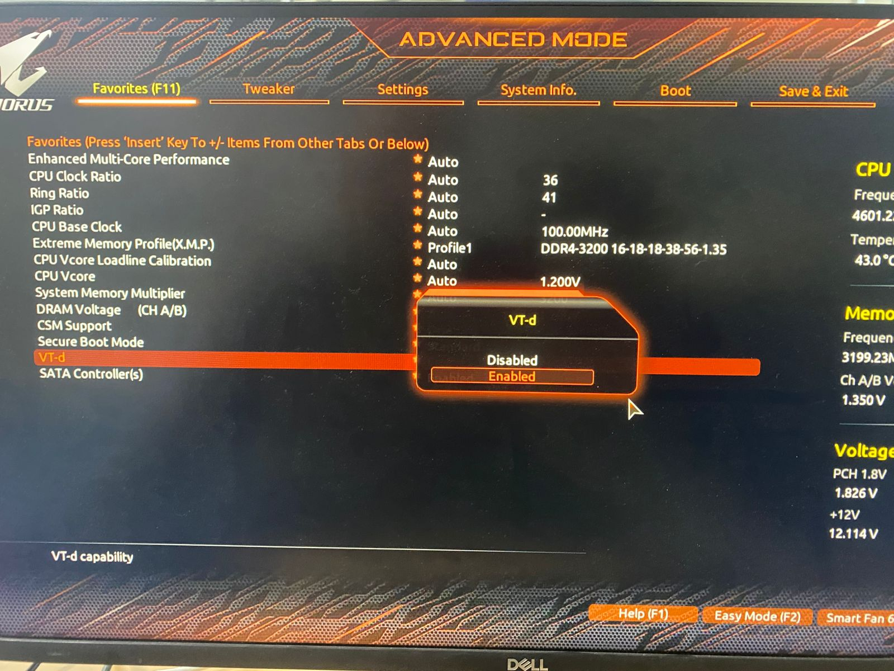

Figure 3	BIOS setting showing VT-d enabled


**3.4. SR-IOV (Single Root I/O Virtualization)**

-   *Setting:* Enabled

-   *Purpose:* Network virtualization optimization

-   *Effects:*

    -   Enables network adapter splitting

    -   Improves network performance for VMs

    -   Allows multiple VMs to share physical network adapters

-    
   
  Figure 4	SR-IOV output page showing enabled virtualization support

**CHAPTER-4**
====
**FIRMWARE & DRIVER INSTALLATION**
======

*To ensure real-time performance and stability in a 5G RAN environment,
it's essential to install the correct firmware, enable a real-time
kernel, and tune system services. This chapter covers those procedures
in detail.*

***4.1 Firmware Update:***
--

> The Intel E810 network interface card (NIC) requires a **one-time firmware update** to enable all features necessary for high-performance networking and SR-IOV.

***4.1.1 Intel E810 Network Adapter Settings***

-   *Driver Version:* 4.2.3

-   *Adapter Configuration:*

    -   Multiple adapters configured (E810-XXV-4T)

    -   MAC Addresses: Configured per adapter

    -   Forward Error Correction: Auto

    -   Link Status: Connected

-   *Purpose:* High-performance network infrastructure

-   *Effects:*

    -   Enables 25GbE network capabilities

    -   Supports network virtualization

    -   Provides redundant connectivity

**4.1.2 Firmware Update Procedure:**

1.  **Download the NVM Update Utility** from Intel's official link:
    [Intel E810 NVM Update
    Tool](https://www.intel.com/content/www/us/en/download/19626/non-volatile-memory-nvm-update-utility-for-intel-ethernet-network-adapters-e810-series-linux.html)

2.  **Install and run the tool** following the steps in the provided
    README.

3.  **Reboot the system** after the firmware update is completed.

 

Figure 5	Intel® Ethernet Network Adapter E810 details After BIOS configuration we need to update the Firmware
update at E810 card.

**NOTE:**

This firmware updates needs to be done only once whenever you are
configuring this system. This is reference [link](<https://www.intel.com/content/www/us/en/download/19626/non-volatile-memory-nvm-update-utility-for-intel-ethernet-network-adapters-e810-series-linux.html>)

**CHAPTER-5**
======
**SOFTWARE INSTALLATION**
========================
The tar package contains the necessary shared libraries and binary for
setting up a **Radio Access Network (RAN)** based on
*OpenAirInterface5G (OAI)* as well as a front-haul interface library
for PHY layer connectivity.

-  **Overview:**

    This project aims to provide seamless integration between the RAN and
    Fronthaul interfaces to enable efficient 5G network operations. This  includes:

   -   *OAI RAN (OpenAirInterface5G)*: Implements RAN functionality.

   -   *Front-haul Interface Library(PHY)*: A library supporting the PHY layer Fronthaul interface, allowing connection between the RAN and remote units.

-  **Pre-Checks**

    *Operating system version*: 22.04 Ubuntu jammy

    *System Hardware Requirement:* 

    ```
    lscpu
    ```


*This above image depicts the hardware setup used in the lab.*


|  **Hardware (CPU,RAM)**                          |**Operating System (kernel)**              |**NIC (Vendor,Driver,Firmware)**
| ------------------------------------------------ |-------------------------------------------|----------------------------------
|  11th Gen Intel(R) Core(TM) i7-11700K @ 3.60GHz  | Ubuntu 22.04.3 LTS (5.15.0-1033-realtime) | Intel E810 ,ice, 4.20

**Note**: These are not minimum hardware requirements.This is the configuration of our servers

**5.1. DPDK Installation**
-----
In a software‑defined RAN, the RAN application (e.g. OAI's
nr‑softmodem) must move packets between the baseband processing and
the NIC at very high rates (tens of Gbps) with minimal
latency---kernel‑based network stacks simply can't keep up. Installing
and using DPDK (Data Plane Development Kit) gives you:

-   **Kernel Bypass & User‑Space Packet I/O**

    > DPDK libraries let your application talk directly to the NIC hardware
    > (via VFIO or UIO drivers) instead of going through the Linux kernel's
    > networking stack. This avoids context switches, copy‑in/copy‑out, and
    > per‑packet interrupts.

-   **Zero‑Copy, Batch Processing**

    > Packets are received in large bursts into huge‑page--backed memory
    > pools (mbufs) you manage in user space. You can process dozens or
    > hundreds of packets with a single API call, rather than one recv()
    > call per packet.

-   **Poll‑Mode Drivers**

    > Instead of interrupt‑driven I/O, DPDK uses tight polling loops on
    > dedicated CPU cores. This ensures deterministic latency (no interrupt
    > latency jitter) and very high throughput---critical for real‐time 5G
    > PHY processing.

-   **Huge Pages & NUMA Awareness**

    > By allocating packet buffers in 2 MB or 1 GB pages, DPDK minimizes TLB
    > misses and maximizes memory bandwidth. You can pin memory and cores
    > per NUMA node to get consistent performance on multi‑socket servers.

-   **Hardware Offload Support**

    > DPDK exposes NIC offloads---checksum, segmentation, RSS, flow
    > steering---in a unified API, allowing your softmodem to leverage
    > hardware acceleration features without complex kernel configuration.

**Steps to install DPDK:**
-

-   **DPDK (Data Plane Development kit):**

    ```
    sudo apt install wget xz-utils libnuma-dev
    sudo apt install meson
    wget http://fast.dpdk.org/rel/dpdk-20.11.9.tar.xz
    ```

-   **DPDK Compilation**
    ```
    tar -xvf dpdk-20.11.9.tar.xz
    cd dpdk-stable-20.11.9/
    meson build
    ninja -C build
    sudo ninja install -C build
    ```

**5.2 RAN Package:**
----

 Download the tar file from the Official channel IOSMCN-RAN/RELEASE-IMAGES (https://github.com/ios-mcn/ios-mcn-releases/tree/main/Agartala/v0.3.0/RAN/release-images/RAN-UNI/ios-mcn-ran-uni-baremetal-v0.3.0.tar.gz)

 Copy the tar file to the target gNB machine (/home/$user/).

**Untar the file using cmd.**

 ```   
tar -xvzf ios-mcn-ran-uni-baremetal-v0.3.0.tar.gz
cd final_artifact

 ```   
**NOTE: Please ensure the tar file must have all the contents as shown below.**

-If the tar package contains the files in the 'bin','lib' and 'utils' directories then you need to move all of them under the directoy 'final_artifact"

*CONTENTS OF TAR PACKAGE:*

- Shared Libraries and Executables

|              |                                                         |    |
|--------------------------|---------------------------------------------------------------------|-----------------------------|
| `libcoding.so`           | `libldpc_orig.so`                                                   | `libparams_libconfig.so`   |
| `libdfts.so`             | `libldpc.so`                                                        | `librfsimulator.so`        |
| `libldpc_optim8seg.so`   | `liboai_device.so → liboai_usrpdevif.so`                            | `libxran.so`               |
| `libldpc_optim.so`       | `liboai_transpro.so → liboran_fhlib_5g_b.so`                        | `macpdu2wireshark`         |
| `nr-cuup`                | `nr-softmodem`                                                      | `T_messages.txt`           |


> **Note:** nr-softmodem binary in this package will works for both USRP as well as LPRU.

 

Figure 6	Extracted contents of the RAN software tar package

**5.3. Post-Extraction Setup**
----

 Firstly, copy the **libxran.so** file to the **/usr/local/lib/**
```
mkdir -p /home/ios-mcn/build_rc4/o-ran-sc-o-du-phy/fhi_lib/lib/build/  #make the exact same path
cp libxran.so   # in this path /home/ios-mcn/build_rc4/o-ran-sc-o-du-phy/fhi_lib/lib/build/

```

Set the shared library linking using utility patchelf . You can install this utility using cmd.
```
sudo apt install patchelf
sudo patchelf --set-rpath <complete path to package ><artifact(nr-softmodem)
```
> **Example command:**
```
sudo patchelf --set-rpath ~/final_artifact/ nr-softmodem
```
> **Environment Setup or General system initial commands**

>**(Run these commands from home folder cd ~/):**

```
sudo timedatectl set-ntp false
sudo cpupower idle-set -D 0
sudo ip link set mtu 8850 <port 0>
sudo ip link set mtu 8850 <port 1>
sudo sysctl -w net.core.rmem_max=62500000
sudo sysctl -w net.core.wmem_max=62500000
sudo sysctl -w net.core.rmem_default=62500000
sudo sysctl -w net.core.wmem_default=62500000
sudo sysctl -w net.core.default_qdisc=fq
sudo sysctl -w net.ipv4.tcp_congestion_control=bbr
sudo ip route add 192.168.70.0/24 via 192.168.X.56(add route according to the core system installed )This is an sample command.
sudo iptables -P FORWARD ACCEPT
sudo sysctl net.ipv4.conf.all.forwarding=1
sudo cpupower frequency-set -g performance -u 4.70GHz -d 4.70GHz
sudo ethtool -G enp2s0f1 tx 4096 rx 4096
sudo sh -c 'echo "1" > /sys/module/vfio/parameters/enable_unsafe_noiommu_mode'
```

 **After this we need to create Virtual function for the same**

**(Run the below mentioned commands from home folder: cd ~/):**

```
sudo sh -c 'echo "0" > /sys/class/net/enp2s0f1/device/sriov_numvfs'
sudo sh -c 'echo "2" >/sys/class/net/enp2s0f1/device/sriov_numvfs'
sudo ip link set <port0> vf 0 vlan 100
sudo ip link set <port1> vf 1 vlan 100
sudo ip link set <port0> vf 0 spoofchk off
sudo ip link set <port1> vf 1 spoofchk off
sudo ip link set dev <port0> vf 0 mac 00:11:22:33:44:66 trust on mtu 8870 #(mac id depends on the RU)
sudo ip link set dev <port1>vf 1 mac 00:11:22:33:44:66 trust on mtu 8870 #(mac id depends on the RU)
sudo /path to dpdk /dpdk-stable-20.11.9/usertools/dpdk-devbind.py--bind vfio-pci 02:09.0
sudo /path to dpdk/dpdk-stable-20.11.9/usertools/dpdk-devbind.py --bind vfio-pci 02:0a.0 #for 710 card
sudo /home/suadmin/IOS/dpdk-stable-20.11.9/usertools/dpdk-devbind.py--bind vfio-pci 02:09.1   #for 810 card
```
- The following command **prints the kernel command line, which
    contains the parameters passed to the Linux kernel at boot time.**

```
cat /proc/cmdline
```
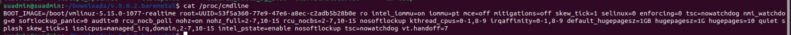

Figure 7	Output of /proc/cmdline showing kernel boot parameters

-**This command displays detailed information about the current CPU
    frequency and its various settings.**

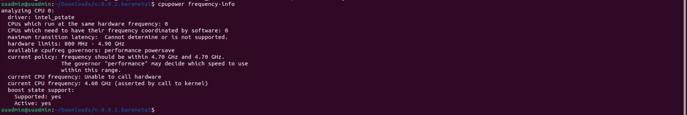

 Figure 8	Output of cpupower frequency-info for CPU frequency settings

```
cpupower frequency-info
```
**CHAPTER-6**
---
**RUNNING THE RAN APPLICATION**
=====
**6.1.USRP Configuration**
----

 This section describes the procedure to execute the nr-soft modem
binary build for USRP b210 board. For execution we need to connect
 b210 on the machine on USB port 3.0.


Figure 9 USRP B210 to gNB hardware connection diagram

**Package Information:**

**Download the tar file from the Official channel**
(wget https://github.com/ios-mcn/ios-mcn-releases/tree/main/Agartala/v0.3.0/RAN/release-images/RAN-UNI/ios-mcn-ran-uni-baremetal-v0.3.0.tar.gz)

Copy the tar file to the target gNB machine (/home/$user/) .Untar the file using cmd.

```
tar -xvzf ios-mcn-ran-uni-baremetal-v0.3.0.tar.gz
cd final_artifact
```

> In case of USRP we don't need any fronthaul binary .We just need to set the dynamic linking of the shared libraries as shared in the package.

> Set the shared library linking using utility patchelf. You can install this utility using cmd.

```
sudo apt install patchelf
sudo patchelf --set-rpath <complete path to package><artifact(nr-softmodem)>
```

> **Environment Setup or general system initial commands**
 **(Run these commands from home folder cd ~/) :**
>
```
sudo timedatectl set-ntp false
sudo cpupower idle-set -D 0
sudo sysctl -w net.core.rmem_max=62500000
sudo sysctl -w net.core.wmem_max=62500000
sudo sysctl -w net.core.rmem_default=62500000
sudo sysctl -w net.core.wmem_default=62500000
sudo sysctl -w net.core.default_qdisc=fq
sudo sysctl -w net.ipv4.tcp_congestion_control=bbr
sudo ip route add 192.168.x.0/24 via 192.168.x.56 ##(add route according to the core system installed )This is an sample command.
sudo iptables -P FORWARD ACCEPT
sudo sysctl net.ipv4.conf.all.forwarding=1
sudo cpupower frequency-set -g performance -u 4.70GHz -d 4.70GHz
sudo ethtool -G enp2s0f1 tx 4096 rx 4096
sudo sh -c 'echo "1" > /sys/module/vfio/parameters/enable_unsafe_noiommu_mode'
```

**After that start the nr-softmodem:**
```
cd final_artifact
sudo taskset -c 10 ./nr-softmodem -O ./<configuration file> --sa -E --usrp-tx-thread-config 1 --thread-pool 3,4,5   #conf file cand be found in the Ran.source package under the openairinterfacev0.3.0/ci-scripts 
```

**Note: The argument to run nr-softmodem binaries are different for
 USRP you can see argument are different and for LPRU Argument passed
in the command are different.**

**6.2. VVDN LPRU Configuration:**
--
 **Before configuring the LPRU we need to run the following commands to make our system(gNB) ready on a configuration level and to synchronize the clocks with respect to the Grandmaster switch which provides GPS signals.**

 **The commands and their description in detail is noted down below:**

1.  run: 
   ```
   sudo ./test.sh
```

This script test.sh configures the 5G gNB system
to work with the LPRU by disabling NTP, setting high MTU and buffer
values, enabling CPU performance mode, and setting up static routes to
IOSMCN-CORE. It also applies essential kernel parameters like BBR and
forwarding. The script ensures synchronization with the Grandmaster
clock and prepares the system for real-time 5G processing. Unsafe
noiommu mode is enabled to support VFIO-based device access.
    
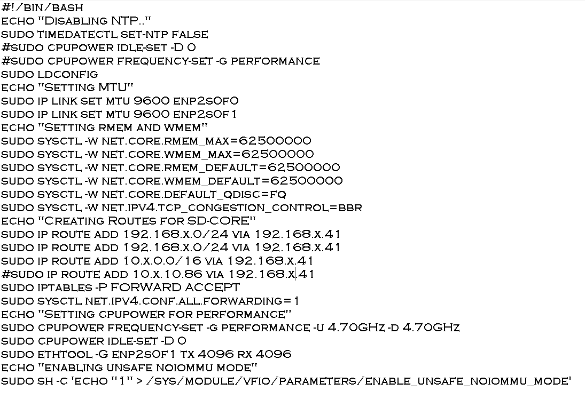 

Figure 10	Contents of the test.sh script for system initialization


 Figure 11	Route creation output after running test.sh script

2.  run:
 ```
 sudo./vf.sh
```
 This script prepares the enp2s0f1 NIC for DPDK-based high-speed data
 plane communication by configuring advanced features such as MTU,
 SR-IOV, VLAN tagging, spoof check disablement, and MAC assignment.

   It enables 2 Virtual Functions (VFs), configures their VLANs and
    trusted modes, and then binds them to vfio-pci drivers using
    dpdk-devbind.py to offload traffic to user space with near real-time
    performance. These settings are crucial for gNB--LPRU data paths,
    especially when handling massive traffic in 5G.


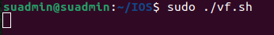 

Figure 12	Running VF configuration script with user privileges


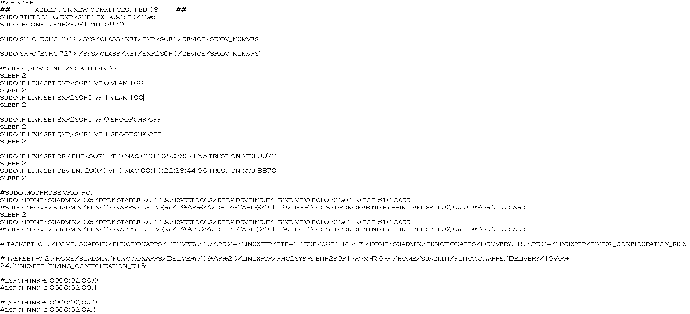 

Figure 13	Details of vf.sh script for DPDK and VF setup

**Then, check whether the function has been created.**
>
> **Run command in terminal:**
```
 ip link show
 ```

 

Figure 14	Output of ip link show displaying virtual function interfaces


3.  Run: 
``` 
   sudo ./slave-enp2s0fo.sh
```
 This command runs ptp4l to make the gNB a PTP slave to the Fibrolan Grandmaster using the G.8275.1 telecom profile, which provides accurate phase and frequency synchronization. It binds the PTP process to CPU core 2 for better real-time performance and uses the network
interface enp2s0f0 for PTP packets. This synchronization is essential for TDD-based 5G systems to ensure time alignment across gNB and LPRU.

 

Figure 15	Script contents for slave PTP configuration (slave-enp2s0fo.sh)


Figure 16	Output after executing slave PTP configuration script

4.  Run: 
   
```
sudo ./master-enp2s0f1.sh
```
 This command runs ptp4l to make the gNB act as a PTP master for the
 VVDN LPRU using the G.8275.1 clock profile. It uses interface enp2s0f1
 and pins the process to core 2 for better timing precision. This
 ensures accurate time distribution from the gNB to the LPRU, enabling
 proper synchronization for 5G operations.


 Figure 17	Script contents for master PTP configuration (master-enp2s0f1.sh)

>

Figure 18	Output of master PTP script to sync LPRU via gNB

5.  Run : 
```
sudo ./phc2sys-master.sh
```
 This command runs **phc2sys** to synchronize the gNB's system clock
 with the hardware clock of interface enp2s0f1, using the G.8275.1
 profile. It ensures tight timing accuracy when the gNB is acting as a
 PTP master. The process is pinned to core 2 for consistent execution
 and uses fine-grained sync parameters to maintain real-time clock
 precision.


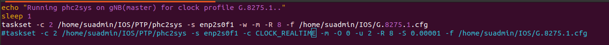
Figure 19	Script for phc2sys-master to sync system and hardware clocks


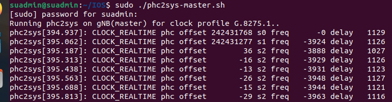

Figure 20	Output of phc2sys-master script


**To access this LPRU (LOW POWER RADIO UNIT),**
-
  
**We need to ssh into the machine with the below provided details:**


-   Username - **root**

-   IP Address - **192.168.4.50**

-   Password: **vvdn**

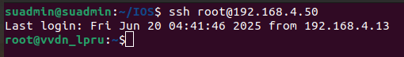 

Figure 21	Logging into LPRU terminal

**Logging into the terminal of the LPRU:**

Once you are logged in, Follow the below provided steps to sync up the LPRU, this includes the synchronization of radio unit, the compression setting , RF antenna configuration, channel parameters and other things.

>**1. To track synchronization progress in real-time by filtering sync-related log entries until the system achieves synchronization.Run command:**
>
 
```
tail -f/var/log/synctimingptp2.log| grep sync
```
**We will wait until the unit synchronizes.**

- This command continuously monitors (tail -f) the **synctimingptp2.log**
file and filters out lines that contain the word sync. You're
essentially waiting and watching until a synchronization message
appears in the log.

 
 
 Figure 22	LPRU synchronization confirmation in terminal
>
- **You can also physically check the bottom most LED on the LPRU.**

 - **It blinks red when the RU is not synchronized, and turns green when
 it is synchronized**


>   **2. To parse and load the e_2x2.xml configuration file for applying
    system or test setup parameters.Run command:**

  ```
  xml_parser e_2x2.xml
  ```

- **Depending on whether we are running SISO (1x1) or MIMO (2x2) and e/f
Fronthaul Interface**

- **For 1x1 use e_1x1.xml, for 2x2 use e_2x2.xml (both for phy-e/phy-f),**

- **This command runs an XML parser tool to read and process the e_2x2.xml configuration file, which likely contains parameters or settings (e.g., antenna config, MIMO setup) used in the 5G lab environment.**

      
     
     Figure 23	XML parser configuration script for LPRU (e_2x2.xml)


    

    Figure 24: Output of the xml_parser file

> **3. To write the value 1919 to memory address a0010024 for configuring a
> specific hardware register or system setting that helps in compressing the data (e.g., I/Q samples) transmitted between the DU (Distributed Unit) and the RU (Radio Unit) over fronthaul interfaces (typically using the eCPRI or ORAN protocols). Run command:**
```
  mw.l a0010024 1919
```
- **This command writes the value 1919 to the memory address a0010024
using the mw.l (memory write long) command. It's typically used to
configure hardware registers, initialize components, or change
settings in embedded/5G systems.**

 

    

Figure 25: Memory register write command run in LPRU terminal

> **4. To edit the live running configuration in Sysrepo using the vi
    editor and To configure and activate transmit carrier parameters ---
    including center frequency, bandwidth, duplex scheme, and RF gain
    --- by editing the system configuration and setting the carrier
    status to ACTIVE, thereby completing the RU's channel setup for 5G
    NR transmission. Run command:**
```
sysrepocfg --edit=vi -d running
```

- **Change 'INACTIVE' to 'ACTIVE' at two places and save the file.**

- **This command opens the running datastore of Sysrepo (a YANG-based
 configuration datastore) for editing using the vi editor. It's used
to view or modify the current live configuration of a network
component or service.**

    

Figure 26	Screenshot of sysrepocfg editor showing ACTIVE status

>- After that **start the nr-softmodem**:
>-Run the below mentioned commands after the user have successfully configured the LPRU.

```
cd final_artifact

```
```
sudo taskset -c 10 ./nr-softmodem -O ./<configuration file> --sa -reorder-thread-disable 1 --thread-pool 3,4,5,7
```

>-   Check logs to validate that ran is up and running:

    

    Figure 27	gNB registration log indicating RAN startup success

**Now, the RU configuration is done.**

**6.3. LEKHA MaRUT LPRU Configuration:**

Before configuring the LPRU we need to run the following commands to make our system(gNB) ready on a configuration level and to synchronize the clocks with respect to the Grandmaster switch which provides 
GPS signals.

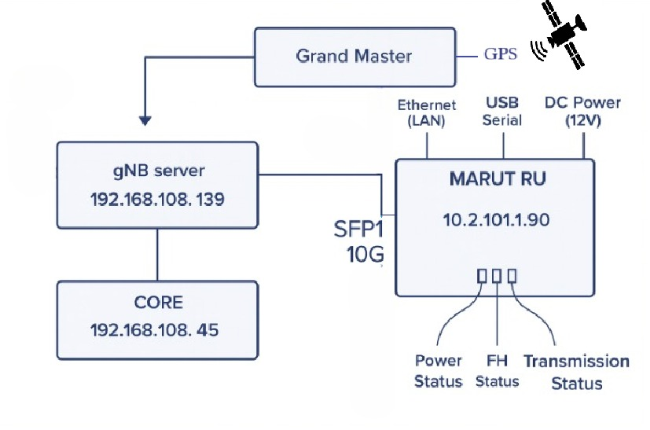

 Figure: Lekha MaRut LPRU Connecttion Diagram.


 The commands and their description in detail can be found on the link noted down below:

 **6.3.1. Configuration/Setup:**
 ----
*To access this MARUT LEKHA LPRU (LOW POWER RADIO UNIT)*
  
We need to ssh into the machine with the below provided details:

- Username - *lekha*

- IP Address - * 10.2.101.90*

- Password: *the password set by the developer*


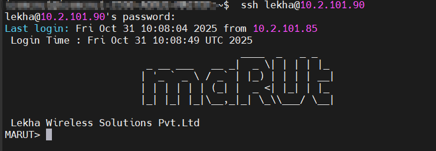

Figure#: Logging into LPRU terminal
----
Once you are logged in, Follow the below provided steps to sync up the LPRU, this includes the synchronization of radio unit, the compression setting , RF antenna configuration, channel parameters and other things.

**1. To track synchronization progress in real-time by filtering sync-related log entries until the system achieves synchronization. Run command:**

```
	get_ptplock_status
```
*The user will wait until the unit synchronizes.*

>- You can also physically check the bottom most LED on the LPRU.

>- It blinks red when the RU is not synchronized, and turns green when it is synchronized

**2. To parse and load the 2x2 and 1x1 respectively configuration file for applying system or test setup parameters.Run command:**

```
	set_numantennas 2 (for 2x2 )
	set_numantennas 1 (for 1x1)
```
 
*Depending on whether we are running SISO (1x1) or MIMO (2x2) and e/f Fronthaul Interface*

These are some important commands which we have to crosscheck with **gNB** parameters (required for changing TDD patterns)

MARUT> set_compression_config
MARUT> set_mtusize
MARUT>  set_fhitimings
MARUT> set_tddconfig 10 DDDDDSUUUUDDDDDSUUUU 6 4 4
MARUT> set_dlcenterfrequency 36050280000
MARUT> set_ulcenterfrequency 36050280000
MARUT> set_framestructure
MARUT> set_eaxcid 4 1 3 8
MARUT> set_ruports 8 5 1 0 1 64
MARUT> set_txattenuation 0 27
MARUT> set_dest_macaddress 0 00:11:22:33:44:77
MARUT> set_src_macaddress 0 00:0A:35:00:24:22

*And these are the commands which we can use to cross-check the other configurations of MARUT LEKHA LPRU :-*

**MARUT linux commands :**  

```
set_dlcenterfrequency 36050280000
>	get_dlcenterfrequency 36050280000
>	set_ulcenterfrequency 36050280000
>	get_dlcenterfrequency 36050280000
>	set_numerology 0 1 0 
>	set_numerology_ssb 0 1 0
>	set_txattenuation 0 27 
>	get_txattenuation 0
>	set_rxgain 0 20 
>	get_rxgain 0 
>	get_version 
>	get_rssi 0
>	get_tssi 0 
>	set_dl_iq_compression 0 9 1 1 
>	set_ul_iq_compression 0 9 1 1
>	set_dltiming_parameters 0 570 370 125 
>	set_ultiming_parameters 0 570 25 110
>	set_eaxcid 4 1 3 8 
>	set_ruports 8 5 1 0 1 64 
>	set_numantennas 1 
>	set_vlan 0 1 0 0 
>	set_vlan 0 1 0 0 
>	set_dest_macaddress 0 00:11:22:33:44:77 
>	set_src_macaddress 0 00:0A:35:00:24:22 
>	set_mtusize 9000
>	set_tddconfig 10 DDDDDSUUUUDDDDDSUUUU 6 4 4 
>	get_fhi_stats 0 
>	get_fhi_capabilities 
>	get_ptplock_status

```

*Now, the RU configuration is done.*

**6.3.2. Testing the Setup:*
----

> After that *start the nr-softmodem*:
>Run the below mentioned commands after the user have successfully configured the LPRU.

```
cd <v.0.0.3.baremetal.tar.gz> #go the directory where the RAN-source package was unzipped and built.
```

 sudo taskset -c 10 ./nr-softmodem -O ./<configuration file> --sa -reorder-thread-disable 1 --thread-pool 3,4,5,7  #3,4,5,7 are the cores used at 

- Check logs to validate that ran is up and running:


**CHAPTER-7**
---
**VERIFICATION & TESTING**
=====
This chapter consists of the steps related to the RAN setup we have
configured and installed for both the Split configurations.

The user will observe the connection to the Core server and will try
attaching the UE (User Equipment) and try the Attach Procedure.

**7.1 Checking IOSMCN Core**
--

Open IOSMCN-core in new terminal:

We will access the IOSMCN-core server machine via **SSH** and view the
status of **the 5G core elements/nodes** that are present on the Kubernetes cluster

```
> ssh administrator@192.168.x.41
> Password: #the password setup by the User
```

> Command: **to watch pods status is mentioned below**

```
watch -n 1 kubectl get pods -A
```


 

Figure 28	Kubernetes pod watch output for core network validation


>**7.1.1** The command **kubectl get svc -n iosmcn -o wide** is used in
> Kubernetes to retrieve detailed information about services in a
> specific namespace.
```
kubectl get svc -n iosmcn -o wide
```


> The command is used for the following reasons:

>-   **Monitoring**: Check the status and details of services running in
     a specific namespace.

>-   **Debugging**: Identify issues with service configurations or
     connectivity.

>-   **Management**: Ensure services are correctly set up and running as
     expected

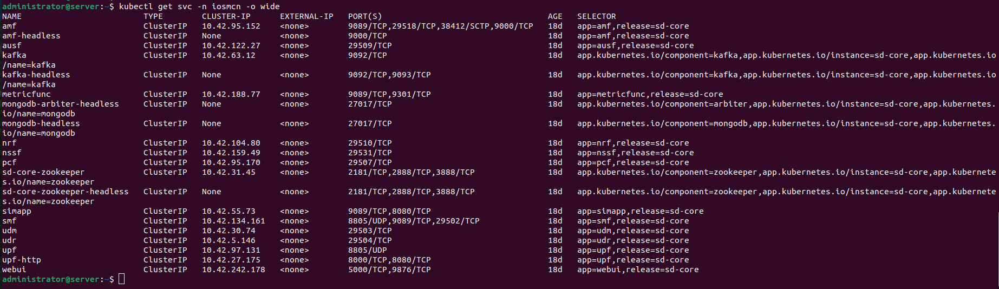

-   The above image is the output of the above given command.

**7.2. Checking the configuration file parameters & Running the
gNb:**
--

> **7.2.1** Change the AMF IP in the gNB conf file **(test-xx.conf)** to the IP that is mentioned in the above step.
>
> **7.2.2** Check the **GNB_IPV_ADDRESS_FOR_NG_AMF** and **GNB_IPV_ADDRESS_FOR_NGU** and set it to the IP of the gNB Machine (Here it is **[192.168.108.149]{.underline}**)


 Figure 29	Checking gNB configuration file parameters before launch
 
> **7.2.3** Run the **nr-softmodem** using the following command to start the gNB

```
sudo taskset -c 10 ./nr-softmodem -O ./<name_of_the_configuration>.conf --sa --reorder-thread-disable 1 --thread-pool 3,4,5,7
```


> The command runs the nr-softmodem process on CPU core 10 with specific
 configuration and optimization options. It disables thread reordering
 and assigns threads to a pool of CPU cores (3, 4, 5, 7). This setup is
 used to optimize the performance and latency of the softmodem in a 5G
 network environment.

**7.3. UE Startup procedures**
---

-   We will pow­­­­­­er on our UE (User Equipment).

-   Remove the flight mode as shown in the screenshot below which will
    in turn start the attach procedure.

 

Figure 30	Selecting the private 5G carrier on UE

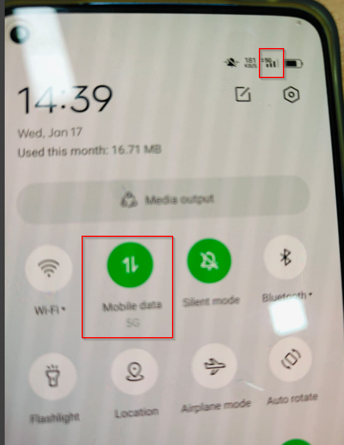

Figure 31	Removing airplane mode on UE to initiate attach procedure


Figure 32: Console log on gNB indicating UE attach success

-   The image below shows that the UE has successfully attached and you
    can see the logs on the core side.


Figure 33	AMF terminal log showing UE attachment and core interaction

**CHAPTER-8**
----
**DOCKERIZED RAN GUIDE**
=====
This chapter provides the steps to deploy the containerized Docker
version of the UNI_RAN software instead of directly installing on the
host machine.

**NOTE:**

For RAN, the container needs **privileged access**, **real-time
scheduling**, and **access to host devices** like NICs (/dev/bus/usb,
/dev/net/tun, or PCI devices). That's why --privileged, --cap-add, and
network_mode: host are typically used in the Docker config.

If you face any diificulty in running the Dockerized version please refer to the Developer Guide & the Troubleshooting Guide.

This process of running the RAN can be achieved by following the
step-by-step guide mentioned below:

**8.1.Load the docker image:**
---

> **8.1.1.** **Pulling the docker image for Split 8 architecture** 
```
sudo docker pull ghcr.io/ios-mcn/ran-gnb-uni:v0.2.1.rc4
```
> **8.1.2.** **Pulling the docker image for Split 7.2 architecture** 
```
sudo docker pull ghcr.io/ios-mcn/ran-gnb-fhi72-uni:v0.2.1.rc4
```
> **8.1.3.** Verify it's loaded
```
sudo docker images
```
**8.2.Prepare the Host Environment:**
---

> **8.2.1.** Copy the **USRP gnb config** and **LPRU config file** in the same path.

-   create a file name **usrp_initialstart.sh** with following content
```
#!/bin/bash
sudo timedatectl set-ntp false
sudo ldconfig
sudo sysctl -w net.core.rmem_max=62500000
sudo sysctl -w net.core.wmem_max=62500000
sudo sysctl -w net.core.rmem_default=62500000
sudo sysctl -w net.core.wmem_default=62500000
sudo sysctl -w net.core.default_qdisc=fq
sudo sysctl -w net.ipv4.tcp_congestion_control=bbr
sudo iptables -P FORWARD ACCEPT
sudo sysctl net.ipv4.conf.all.forwarding=1
sudo ufw disable
sudo cpupower frequency-set -g performance -u 4.70GHz -d 4.70GHz
sudo cpupower idle-set -D 0
```

**8.3 Creating a docker-compose.yaml file:**
---

> The user should create a **docker-compose.yaml** file which allows the user to define, configure and manage your RAN container in a clear and structured way.
>
> Also you can reliably relaunch the same RAN every time with the below
> provided content, without manually typing docker run commands.

```
version: '3.8'

    services: gnb_mono_tdd:
     image: oai-gnb:latest  # image name of usrp or lpru
     container_name: USRP-gnb

     privileged: true

    cap_drop:
    - ALL

    cap_add:
    - SYS_NICE
    - IPC_LOCK

    ulimits:
    core: -1

    environment:

    USE_B2XX:'yes'

    USE_ADDITIONAL_OPTIONS:
    --RUs.[0].sdr_addrs serial=34414CB --continuous-tx --log_config.global_log_options level,nocolor,time,line_num,function

    devices:
    - /dev/bus/usb:/dev/bus/usb

    volumes:
    - /tmp/oai_trace_pipe:/tmp/oai_trace_pipe

    - /home/ios-mcn/gnb.sa.band78.fr1.106PRB.usrpb210_.conf:/opt/oai-gnb/etc/gnb.conf

    network_mode: "host"

    command: >

    /opt/oai-gnb/bin/nr-softmodem -O /opt/oai-gnb/etc/gnb.conf --sa -E --usrp-tx-thread-config 1 --thread-pool 3,4,5

    healthcheck:

        test: /bin/bash -c "ps aux | grep -v grep | grep -c softmodem"
        
        interval: 10s

        timeout: 5s

        retries: 5
```


> **NOTE:--RUs.[0].sdr_addrs serial=34414CB.**
**Change the serial no. [3441CB] to the usrp actual serial no. present in your setup.**

**8.4. Launch the Container:**
-----
 With the below mentioned command the user can launch the 5G RAN node
inside a prepared container, wires up its configuration and hardware,
and also logs the boot process that will enable the user to a fully
 containerized and reproducible deployment

```
docker-compose up | tee output.txt
```

REFERENCE
=========

1]. 3GPP, *System Architecture for the 5G System (Release 17)*, 3GPP
TS 23.501 V17.7.0, 3rd Generation Partnership Project, Dec. 2023.
[Online]. Available: <https://www.3gpp.org>

2]. OpenAirInterface Software Alliance, "OpenAirInterface5G."
[Online]. Available: <https://www.openairinterface.org>

3]. Software Radio Systems, "srsRAN Project," 2023. [Online].
Available: <https://www.srsran.com>

4]. free5GC Organization, "free5GC -- Open-source 5G Core Network,"
[Online]. Available: <https://www.free5gc.org>

5]. A. Checko, H. L. Christiansen, Y. Yan, L. Scolari, G. Kardaras, M.
S. Berger, and H. L. Dittmann, "Cloud RAN for mobile networks---A
technology overview," *IEEE Commun. Surveys Tuts.*, vol. 17, no. 1, pp.
405--426, First Quarter 2015.

6]. Ericsson, *Private 5G Networks -- Accelerating Industry
Digitalization*, White Paper, 2021. [Online]. Available:
https://www.ericsson.com/en/reports-and-papers/white-papers/private-5g-networks

7]. Qualcomm, *Private 5G Networks: Benefits, Use Cases, and
Deployment Scenarios*, 2022. [Online]. Available:
<https://www.qualcomm.com>

8]. GSMA Intelligence, *The Mobile Economy 2023*, GSMA, 2023.
[Online]. Available: https://www.gsma.com/mobileeconomy

9]. M. Sauter, *From GSM to LTE-Advanced Pro and 5G: An Introduction
to Mobile Networks and Mobile Broadband*, 3rd ed. Hoboken, NJ, USA:
Wiley, 2021.

10]. Intel Corporation, *Enabling Private 5G Networks with Open Source
and Edge Computing*, White Paper, 2022. [Online]. Available:
<https://www.intel.com>
