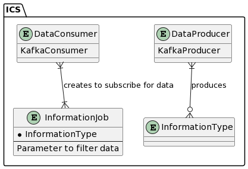
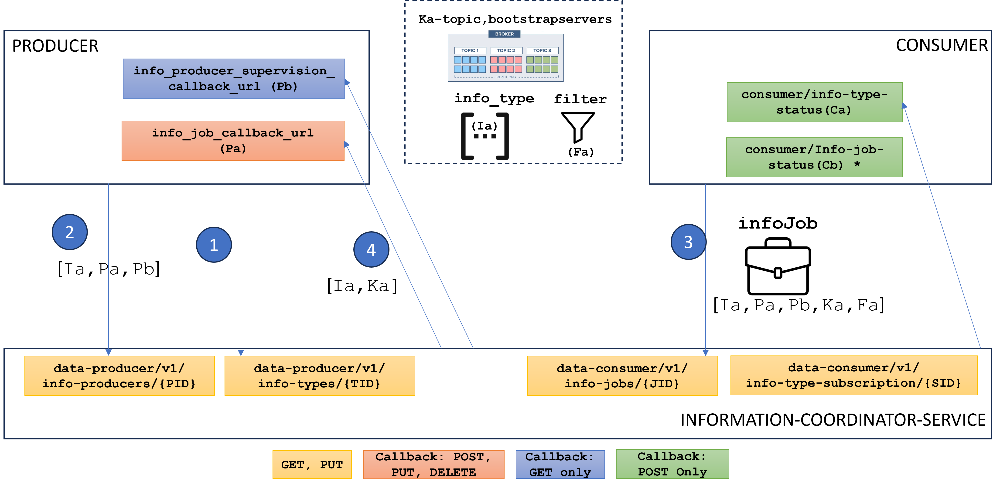
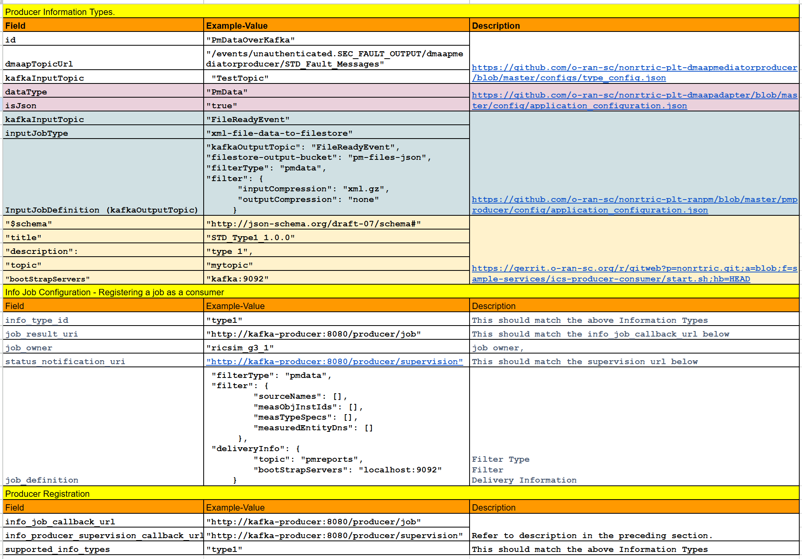

.. This work is licensed under a Creative Commons Attribution 4.0 International License.
.. SPDX-License-Identifier: CC-BY-4.0

Information Co-Ordinator Service
================================
Non-RT-RIC Information Co-Ordinator Service is a "Data management and exposure" Service that manages data subscriptions. It separates data consumers from data producers (for different vendor). Data consumer doesn't need to be aware of where the data source is.

Terminologies:
--------------
* Information Type: Represents the types of data that can be produced by data producers and consumed by data consumers.
* Information Job: Represents an active data subscription by a data consumer, specifying the type of data to be produced and additional parameters for filtering.
* Data Consumer: Represents entities that consume data and manage data subscription jobs.
* Data Producer: Represents entities that produce data.

The below image summarizes the entities involved in ICS.

Description
-----------
The overall working of the ICS is summarized in the below figure. The ICS itself exposes following APIs:

* Data producer API:
    * Information Type and Information Producer
        * Producer CALLBACKS: GET healthcheck (supervision); Information Job Creation/Modification/Delete.

* Data consumer API:
    * Information Type Subscription Creation/Modification/Delete (REGISTERED/UNREGISTERED); Information Job (Creation/Modification/Delete) and GET Information Type
        * Consumer CALLBACKS: POST Information Type Status: REGISTERED/UNREGISTERED invoked when a Information type status has been changed

* Service status API: Returns statistics such as Number of Producers Types and Jobs
* 

Typical flow:
-------------

1) Create a type (PUT /info-types)
2) Create a producer (PUT /info-producers) {supports type for filtering}
3) Create a job (PUT /info-jobs) {consumer subscription}
4) Callback Producer (POST/info-job) [refer to section on producer callbacks]

Summary:
--------

Producer Callbacks
------------------

"jobCallbackUrl" and "producerSupervisionCallbackUrl" are used for communication between a service and external producers in the context of the Information Control Service (ICS).

jobCallbackUrl: This URL serves as a callback endpoint for the producer. When the service needs to communicate or interact with the producer regarding a specific job, it sends requests to this URL. In the stopInfoJob() method, the service constructs a URL by appending the job ID to the jobCallbackUrl of the producer. Then it sends a DELETE request to this URL, effectively stopping the job. In the startInfoJob() method, the service sends a POST request to the jobCallbackUrl to start a job in the producer.

producerSupervisionCallbackUrl: This URL is used for health checks or supervision purposes. The service can send requests to this URL to check the health or status of the producer. In the healthCheck() method, the service sends a GET request to the producerSupervisionCallbackUrl to check the health of the producer.

In summary, both URLs facilitate communication between the service and external producers, enabling actions like starting and stopping jobs, as well as monitoring the health and status of the producers.

Configuration
-------------

