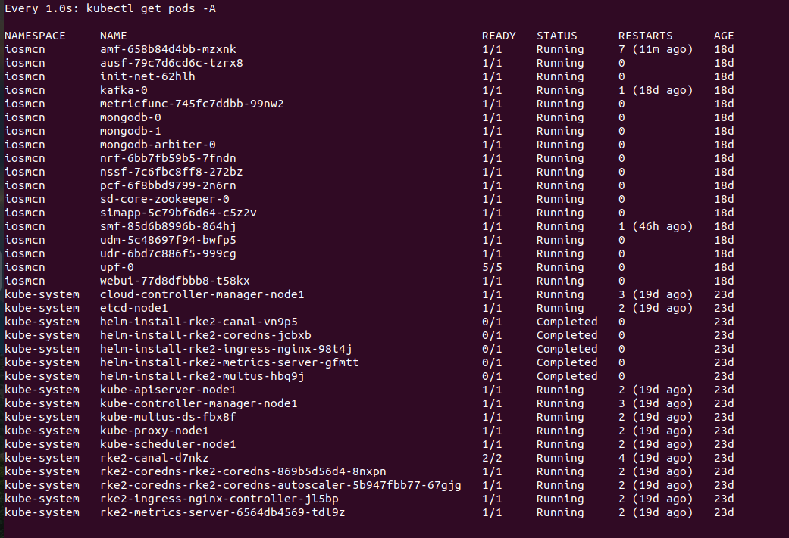
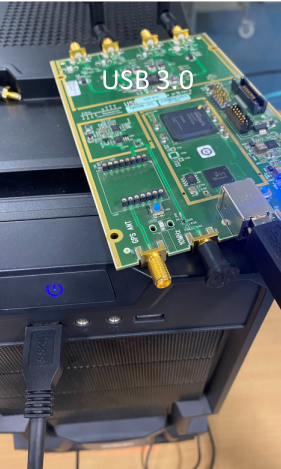
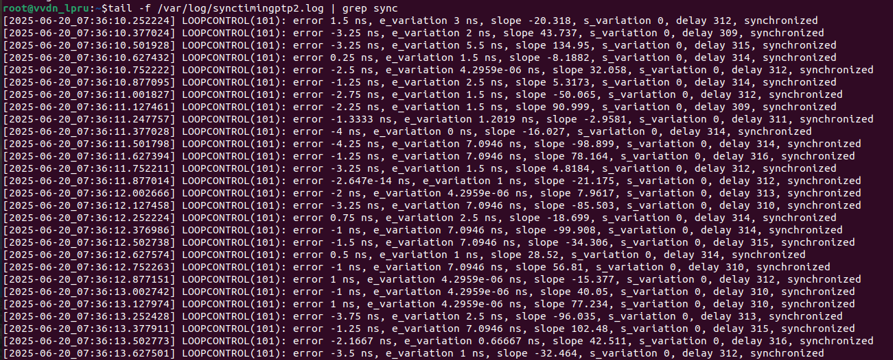
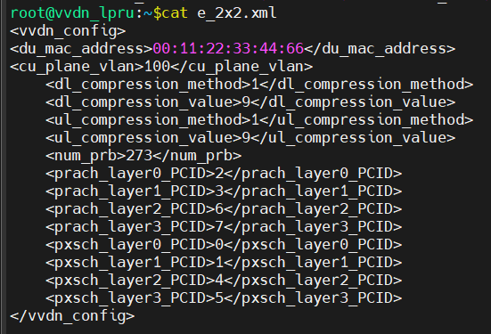
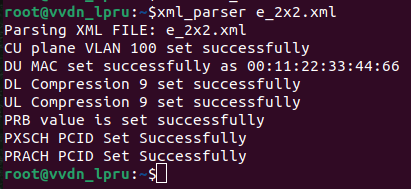

# IOS MCN v0.4.0 Agartala Release - User Guide 
-----
The **IOS-MCN RAN Sub-Project** aim to deliver a functional, high-performance, and easily deployable Radio Access Network (RAN) based on open-source components such as *OpenAirInterface5G (OAI)*. This user guide outlines the complete process required to deploy a working 5G gNB (gNodeB) capable of interacting with either a LPRU or software-defined radio hardware like USRP B210.


# Purpose and Audience
-----
The purpose of this document is to  present the user guide of a private 5G RAN using open-source software, highlighting key components and deployment strategies.

The audience of this document is the end user who is trying to run the UNI RAN in different deployment environments.
1. Baremetal 
2. Containerized Docker Version

# IOS MCN RAN UNI Test Information
----
The setup is optimized for **low-latency, high-throughput performance**	on Ubuntu 22.04 LTS with **real-time kernel** support, DPDK-based user-space networking, and **BIOS-level optimizations**. It also covers advanced configurations such as CPU core isolation, clock synchronization using PTP, and Dockerized deployment for reproducibility and isolation.

Please refer installation guide.(Section 5.1)

# Supported Features
----

Please refer to the below link for the list of features 
https://github.com/ios-mcn/ios-mcn-releases/releases


# Supported Hardware
----

> **Hardware Environment Used for Testing:**
>
>-   *CPU:* 11th Gen Intel(R) Core(TM) i7-11700K @ 3.60GHz
>
>-   *Memory:* 64 GB DDR4
>
>-   *NIC:* Intel E810-XXV-4T (25GbE)
>
>-   *Storage:* NVMe SSD
>
>-   *Radio Hardware:*
>
>	-   USRP B210 (for split 8)
>
>	-   VVDN LPRU (for split 7.2)
>
> 	-   LEKHA maRut LPRU (for split 7.2)
> 	  
>-   *UE/MOBILE PHONE:* 5G IMS Enabled user equipments/mobile phones(preferably using **Android OS**)

Please refer to the UNI_RAN Installation Guide document for further details.

# How to Run and Boot up the CORE(Common For both Environments:Baremetal & Dockerized version)
----

- Please ensure that you have successfully installed an open-source Core server installed that you are trying to link to the RAN.
- In this section, the test environment uses IOSMCN-Core-server i.e., a part of the *Agartala v0.4.0 IOS-MCN CORE Sub-Project Release*. The relevant guides can be referred in the same repository.

**Booting up the IOSMCN-Core**
--

*Open IOSMCN-core in new terminal:*

We will access the server machine where we have installed **IOSMCN-core** via **SSH** and view the status of **the 5G core elements/nodes** that are present on the Kubernetes cluster.

```
ssh administrator@192.168.x.X

Enter the Password: xxx@123 #The password of the above metioned user
```


**To watch pods status use the command mentioned below**
```
watch -n 1 kubectl get pods -A
```


 

Figure#:Kubernetes pod watch output for core network validation


**1.1.** The command **kubectl get svc -n iosmcn -o wide** is used in Kubernetes to retrieve detailed information about services in a specific namespace.
```
kubectl get svc -n iosmcn -o wide
```


> The command is used for the following reasons:
>
>-   **Monitoring**: Check the status and details of services running in a specific namespace.
>
>-   **Debugging**: Identify issues with service configurations or connectivity.
>
>-   **Management**: Ensure services are correctly set up and running as expected


*The above image is the output of the above given command.*

**1.2. Checking the configuration file parameters & Running the gNb:**

> **1.2.1** Change the AMF IP in the gNB conf file **(test-xx.conf)** to the IP that is mentioned in the above step.
>
> **1.2.2** Check the **GNB_IPV_ADDRESS_FOR_NG_AMF** and **GNB_IPV_ADDRESS_FOR_NGU** and set it to the IP of the gNB Machine (Here it is **[192.x.X.149]**)


 Figure#:Checking gNB configuration file parameters before launch

> **1.2.3** Run the **nr-softmodem** using the following command to RUN THE RAN.
> Refer to the Installation Guide(Section 7)

# How to connect the supported hardware
	
	
**1. USRP**
----
**1.1. Configuration/Setup:**
----
 
Refer to the UNI_RAN Installation Documentation (link mentioned in the below table)

**1.2. Testing the Setup:**
----

This section describes the procedure to execute the **nr-softmodem binary** build for **USRP b210 board**. For execution we need to connect b210 on the machine on USB port 3.0.



Figure#: USRP b210 to gNB hardware connection diagram


After that start the nr-softmodem:

```
 Untar release image file by the command tar -xzvf v.0.0.X.baremetal.tar.gz
 cd v.0.0.X.baremetal
 cd final_artifact
 mv bin/* .
 mv lib/* .
 mv utils/* .
 Set patchelf path if required using command : sudo -E patchelf --set-rpath (copy the address of where the binary is kept) ./nr-softmodem
 
 Execute gNB binary as follows:
 sudo taskset -c 10 ./nr-softmodem -O ./<configuration file> --sa -E --usrp-tx-thread-config 1 --thread-pool 3,4,5
```

**Note**: *The argument to run nr-softmodem binaries are different for USRP you can see argument are different and for LPRU Argument passed in the command are different.*

**2. LPRU :**
--

**Before configuring the LPRU we need to run the following commands to make our system(gNB) ready on a configuration level and to synchronize the clocks with respect to the Grandmaster switch which provides GPS signals.**

 **The commands and their description in detail can be found on the link noted down below:**

 **2.1. Configuration/Setup:**
 ----

**To access this LPRU (LOW POWER RADIO UNIT)**
  
*We need to ssh into the machine with the below provided details:*


- Username - **root**

- IP Address - **192.168.4.50**

- Password: **the password set by the developer**

 

Figure#:Logging into LPRU terminal

**Logging into the terminal of the LPRU:**
----

Once you are logged in, Follow the below provided steps to sync up the LPRU, this includes the synchronization of radio unit, the compression setting , RF antenna configuration, channel parameters and other things.

**1. To track synchronization progress in real-time by filtering sync-related log entries until the system achieves synchronization.Run command:**


```
tail -f/var/logs/synctiming2.log| grep sync
```
**The user will wait until the unit synchronizes.**

- This command continuously monitors (tail -f) the **synctiming2.log** file and filters out lines that contain the word sync. You're essentially waiting and watching until a synchronization message appears in the log.

 
 
 Figure#:LPRU synchronization confirmation in terminal

- **You can also physically check the bottom most LED on the LPRU.**

- **It blinks red when the RU is not synchronized, and turns green when it is synchronized**


**2. To parse and load the e_2x2.xml configuration file for applying
    system or test setup parameters.Run command:**

  ```
  xml_parser e_2x2.xml
  ```

>-**Depending on whether we are running SISO (1x1) or MIMO (2x2) and e/f Fronthaul Interface**
>
>- **For 1x1 use e_1x1.xml, for 2x2 use e_2x2.xml (both for phy-e/phy-f)**
>
>- **This command runs an XML parser tool to read and process the e_2x2.xml configuration file, which likely contains parameters or settings (e.g., antenna config, MIMO setup) used in the 5G lab environment.**


 

Figure #:XML parser configuration script for LPRU (e_2x2.xml)




Figure#: Output of the xml_parser file

**3. To write the value 1919 to memory address a0010024 for configuring a specific hardware register or system setting that helps in compressing the data (e.g., I/Q samples) transmitted between the DU (Distributed Unit) and the RU (Radio Unit) over fronthaul interfaces (typically using the eCPRI or ORAN protocols). Run command:**

```
  mw.l a0010024 1919
```
- **This command writes the value 1919 to the memory address a0010024
using the mw.l (memory write long) command. It's typically used to
configure hardware registers, initialize components, or change
settings in embedded/5G systems.**

 
 

Figure#: Memory register write command run in LPRU terminal

**4. To edit the live running configuration in Sysrepo using the vi
    editor and To configure and activate transmit carrier parameters ---
    including center frequency, bandwidth, duplex scheme, and RF gain
    --- by editing the system configuration and setting the carrier
    status to ACTIVE, thereby completing the RU's channel setup for 5G
    NR transmission. Run command:**
```
sysrepocfg --edit=vi -d running
```

- **Change 'INACTIVE' to 'ACTIVE' at two places and save the file.**

- **This command opens the running datastore of Sysrepo (a YANG-based
configuration datastore) for editing using the vi editor. It's used
to view or modify the current live configuration of a network
component or service.**

 

Figure#:Screenshot of sysrepocfg editor showing ACTIVE status

**Now, the RU configuration is done.**

**2.2. Testing the Setup:**
----

> After that **start the nr-softmodem**:
>Run the below mentioned commands after the user have successfully configured the LPRU.

```
cd <v.0.0.3.baremetal.tar.gz> #go the directory where the RAN-source package was unzipped and built.
```
```
 sudo taskset -c 10 ./nr-softmodem -O ./<configuration file> --sa -reorder-thread-disable 1 --thread-pool 3,4,5,7 #here 3,4,5,7 are the cores used for  
```

- Check logs to validate that ran is up and running:


Figure#:gNB registration

**3. Lekha MaRut LPRU**
---
Before configuring the LPRU we need to run the following commands to make our system(gNB) ready on a configuration level and to synchronize the clocks with respect to the Grandmaster switch which provides 
GPS signals.*


Figure#:Lekha MaRut structure diagram

 The commands and their description in detail can be found on the link noted down below:

 **2.1. Configuration/Setup:**
 ----
*To access this MARUT LEKHA LPRU (LOW POWER RADIO UNIT)*
  
We need to ssh into the machine with the below provided details:

- Username - *lekha*

- IP Address - * 10.2.101.90*

- Password: *the password set by the developer*


Figure#: Logging into LPRU terminal

----
Once you are logged in, Follow the below provided steps to sync up the LPRU, this includes the synchronization of radio unit, the compression setting , RF antenna configuration, channel parameters and other things.

**1. To track synchronization progress in real-time by filtering sync-related log entries until the system achieves synchronization. Run command:**

```
get_ptplock_status
```
*The user will wait until the unit synchronizes.*

>- You can also physically check the bottom most LED on the LPRU.

>- It blinks red when the RU is not synchronized, and turns green when it is synchronized

**2. To parse and load the 2x2 and 1x1 respectively configuration file for applying system or test setup parameters.Run command:**

```
	set_numantennas 2 (for 2x2 )
	set_numantennas 1 (for 1x1)
```
 
*Depending on whether we are running SISO (1x1) or MIMO (2x2) and e/f Fronthaul Interface*

These are some important commands which we have to set parameters (required for changing TDD patterns)

```
MARUT> set_compression_config
MARUT> set_mtusize
MARUT>  set_fhitimings
MARUT> set_tddconfig 10 DDDDDSUUUUDDDDDSUUUU 6 4 4
MARUT> set_dlcenterfrequency 36050280000
MARUT> set_ulcenterfrequency 36050280000
MARUT> set_framestructure
MARUT> set_eaxcid 4 1 3 8
MARUT> set_ruports 8 5 1 0 1 64
MARUT> set_txattenuation 0 27
MARUT> set_dest_macaddress 0 00:11:22:33:44:77
MARUT> set_src_macaddress 0 00:0A:35:00:24:22
```

*And these are the commands which we can use to cross-check the other configurations of MARUT LEKHA LPRU :-*

**Lekha MARUT commands :**  

```
    set_dlcenterfrequency 36050280000
	get_dlcenterfrequency 36050280000
	set_ulcenterfrequency 36050280000
	get_dlcenterfrequency 36050280000
	set_numerology 0 1 0 
	set_numerology_ssb 0 1 0
	set_txattenuation 0 27 
	get_txattenuation 0
	set_rxgain 0 20 
	get_rxgain 0 
	get_version 
	get_rssi 0
	get_tssi 0 
	set_dl_iq_compression 0 9 1 1 
	set_ul_iq_compression 0 9 1 1
	set_dltiming_parameters 0 570 370 125 
	set_ultiming_parameters 0 570 25 110
	set_eaxcid 4 1 3 8 
	set_ruports 8 5 1 0 1 64 
	set_numantennas 1 
	set_vlan 0 1 0 0 
	set_vlan 0 1 0 0 
	set_dest_macaddress 0 00:11:22:33:44:77 
	set_src_macaddress 0 00:0A:35:00:24:22 
	set_mtusize 9000
	set_tddconfig 10 DDDDDSUUUUDDDDDSUUUU 6 4 4 
	get_fhi_stats 0 
	get_fhi_capabilities 
	get_ptplock_status

```

*Now, the RU configuration is done.*

*2.2. Testing the Setup:*
----

> After that *start the nr-softmodem*:
>Run the below mentioned commands after the user have successfully configured the LPRU.

```
cd <v.0.0.3.baremetal.tar.gz> #go the directory where the RAN-source package was unzipped and built.

 sudo taskset -c 10 ./nr-softmodem -O ./<configuration file> --sa -reorder-thread-disable 1 --thread-pool 3,4,5,7 

```
- Check logs to validate that ran is up and running:


**4. UE (User Equipment/Mobile Phones)**
---
**4.1. Configuration/Setup:**

**4.2. Testing the Setup:**

-   We will pow­­­­­­er on our UE (User Equipment).

-   Remove the flight mode as shown in the screenshot below which will
    in turn start the attach procedure.

 

Figure#:Selecting the private 5G carrier on UE


Figure#:Removing airplane mode on UE to initiate attach procedure


Figure#:Console log on gNB indicating UE attach success

-   The image below shows that the UE has successfully attached and you
    can see the logs on the core side.


Figure#:AMF terminal log showing UE  and core interaction
attachment

# To Run the Dockerized Version 

The user needs to check the Docker image from the repository and follw the below given steps

## Load the images into Docker:

```
 sudo docker load -i /path/to/uni-ran-gnb.tar
```
## Launch the Container:

> With the below mentioned command the user can launch the 5G RAN node inside a prepared container, wires up its configuration and hardware,and also logs the boot process that will enable the user to a fully containerized and reproducible deployment

```
 docker-compose up | tee output.txt
```
For any related information please refer to the Installation and Developers Guide.(Sections 8 and 4 respectively.)


# Features:

The following section shows the usage of the feature that is supported with UNI RAN;

- **1. VoNR/ViNR**
- **2. N2 Handover**
- **3. RRC IDLE state & Paging**
- **4. RFSimulator UE**
  

## 1 VoNR/ViNR:

  **1.1. Configuration/Setup**

> To use VoNR please go through the sections provided below:

### Prerequisites:
- Private 5G SA (Standalone) network with IMS support
- Two Android UEs with 5G NR and VoNR capability
- SIM cards provisioned for IMS services
- Core network configured for VoNR (AMF, SMF, UPF, IMS)
- gNodeB configured and operational


**1.1.1. Core Network Status Check**
- Verify AMF (Access and Mobility Management Function) is running
- Confirm SMF (Session Management Function) is operational
- Check UPF (User Plane Function) connectivity
- Validate IMS core components (P-CSCF, I-CSCF, S-CSCF, HSS/UDM)
- Ensure DNS resolution for IMS domains is configured

**1.1.2. Start the RAN(Radio Access Network) Check**
- Verify gNodeB is broadcasting 5G NR signals
- Confirm cell parameters (PCI, TAC, PLMN)
- Check that VoNR is enabled in gNodeB configuration
- Validate QCI/5QI profiles for voice services are configured


**1.1.3 SIM Card Configuration**
- Insert SIM cards with IMS provisioning in both UEs
- Verify SIM cards have correct IMSI, Ki, OPc values
- Confirm IMS APN settings are provisioned on SIM
- Check that VoLTE/VoNR flags are enabled in SIM profile

**1.1.4. Android UE Settings - UE1**
1. Power on the first Android UE
2. Navigate to **Settings > Mobile Network**
3. Select your carrier/SIM card
4. Enable **5G** network mode


**1.1.5. Android UE Settings - UE2**
Repeat the same configuration steps as UE1:
1. Power on the second Android UE
2. Configure identical network and call settings
3. Ensure both UEs use the same network operator settings

**1.1.6. UE1 Registration Process**
1. Verify UE1 shows **5G** or **5G SA** in status bar
2. Check signal strength is adequate (-70 dBm or better)
3. Confirm UE has obtained IP address via PDU session
4. Monitor registration logs for successful AMF attachment
   - Check: Registration Accept message received
   - Verify: Security context established
   - Confirm: Default bearer established

**1.1.7. UE2 Registration Process**
1. Repeat registration verification for UE2
2. Ensure both UEs are registered to same AMF/cell
3. Verify both UEs have active PDU sessions

**1.1.8. Verify VoNR is Active on Both UEs On each UE**

1.	Check "IMS Status":Registered.
2.	Verify network type: NR or 5G.
3.	Confirm "VoNR" icon is visible in the status bar.

## 1.2. Testing Procedure

**1.2.1. Outgoing Call - UE1 to UE2**
1. On UE1, open the phone dialer
2. Dial the number assigned to UE2
3. Press call button
4. Monitor that call stays on 5G (no fallback to 4G)
5. Verify call setup time is acceptable (< 3 seconds)

**1.2.2. Call Progress Monitoring**
During call setup, verify:
- SIP INVITE sent through IMS core
- Media negotiation completed
- RTP stream established over 5G NR
- No circuit-switched fallback occurs
- Voice quality is acceptable

**1.2.3. Bidirectional Call Testing**
1. Answer call on UE2
2. Test audio quality in both directions
3. Verify call remains on 5G NR throughout
4. Test call hold/resume functionality
5. Test call transfer if supported

**1.2.4. Incoming Call - UE2 to UE1**
1. End the first call
2. Initiate call from UE2 to UE1
3. Repeat all verification steps
4. Confirm bidirectional VoNR capability


## Succcesfull implementation
- Both UEs registered on 5G SA network  
- IMS registration successful on both UEs  
- VoNR calls establish without CS fallback  
- Good voice quality in both directions  
- Call setup time < 3 seconds  
- Calls remain on 5G throughout duration  
- Basic supplementary services functional  

## Monitoring and Logs
- Core network logs (AMF, SMF, IMS)
- gNodeB performance counters
- UE field test logs
- SIP signaling traces
- RTP media quality metrics 

## 2. Intra-frequency N2 Handover:

  **2.1. Configuration/Setup**

> To use Intra-frequency N2HO please go through the sections provided below:

### Prerequisites:
- 2 gNB systems with the hardware and software specification and 1 common core Network system
- Two Android UEs with 5G NR and VoNR(if in use)Capabilities
- SIM cards provisioned for private 5G services
- Core network configured for N2 Handover (AMF, SMF, UPF, IMS)
- gNodeB configured and operational
- 2 LPRU's with the same frequency specifications( absolute Frequency SSB, Center frequency,Offset to Point A) 


**2.1.1. Core Network Status Check**
- Verify AMF (Access and Mobility Management Function) is running
- Confirm SMF (Session Management Function) is operational
- Check UPF (User Plane Function) connectivity
- Confirm the IMSI of the SIM's insterted has been added to the HSS in the core

**2.1.2. Start the RAN(Radio Access Network) Check**
- Verify gNodeB is broadcasting 5G NR signals
- Confirm cell parameters (PCI, TAC, PLMN)
- Check whether **neighbour_list** are configured properly in both source and Target gNB's 


**2.1.3 SIM Card Configuration**
- Verify SIM cards have correct IMSI, Ki, OPc values

**2.1.4. Android UE Settings - UE1**
1. Power on the first Android UE
2. Navigate to **Settings > Mobile Network**
3. Select your carrier/SIM card
4. Enable **5G** network mode


**2.1.5. Android UE Settings - UE2**
Repeat the same configuration steps as UE1:
1. Power on the second Android UE
2. Configure identical network and call settings
3. Ensure both UEs use the same network operator settings

**2.1.6. UE1 Registration Process**
1. Verify UE1 shows **5G** or **5G SA** in status bar
2. Check signal strength is adequate (-70 dBm or better)
3. Confirm UE has obtained IP address via PDU session
4. Monitor registration logs for successful AMF attachment
   - Check: Registration Accept message received
   - Verify: Security context established
   - Confirm: Default bearer established

**2.1.7. UE2 Registration Process** (optional, to be used if using 2 UE in the test cases)
1. Repeat registration verification for UE2
2. Ensure both UEs are registered to same AMF/cell
3. Verify both UEs have active PDU sessions
   

**2.1.8. Verify the signal is Active on Both UEs**

1.	Check "Status":Registered.
2.	Verify network type: NR or 5G.


## 2.2. Testing Procedure

**2.2.1. Running the active ping**
1. Run the source gNB with the correct configuration file that has the nearby 2nd RU specificcation entered as the neighbour.( The example is attached in the image below)
2. For example we have used the Aruba utilities app to Run Ping load test on the 8.8.8.8 DNS address (example image attached below)
3. Start the ping on the UE1
4. Monitor the ping test is running without drop.

**2.2.2. Powering on the Target gNB**

1. Verify whether all the prerequisites are met at the target gNB side as well before starting the test.
2. Go through the Target configuration file and check strictly whether the Source gNB details are entered perfectly (an example has been attached below)
3. After going through the above steps, trigger the target gNB.
4. Alternatively you can start the packet capture on the target gNB

**2.2.3. Performing the Handover**
1. Now move the UE 1 away from the LPRU attached at the the source towards the target.
2. While performing the step 1 of this subsection keep watching for **Handover Command** prints on the souce gNB console
3. Now watch the console on the target gNB
4. Check whether the ping has been running continously.
5. Check the target console prints for whether the attach attempt is CFRA(Contention-Free RACH Attempt)

**2.2.4. Repeating the same process with UE2**
1. After all these processes attach the second UE
2. Start the Youtube utility on the device.
3. Check whether the media is running on the application.
4. Repeat the steps you have performed for UE1.


## 3. RRC_IDLE State & Paging

  **3.1. Description**
> The RRC Idle State allows the UE (User Equipment) to conserve battery by reducing signaling when no active data session is ongoing. Paging ensures the network can reach the UE when needed.

The parameter which we include in our Configuration files:

 |Parameter        			|Description 															 |Range / Value |
 |--------------------------|------------------------------------------------------------------------|--------------|
 |inactivity_timer_threshold|Time (in seconds) after which UE transitions to RRC Idle if no activity.|0–300 (0 → Disabled)|
 |inactivity_interval_sec   |Fixed interval in seconds for inactivity monitoring.					 |1 (Fixed)|
 |inactivity_interval_us	|Fixed interval in microseconds for inactivity monitoring.				 |0 (Fixed)|

  **3.2. Configuration/Setup**

> To use **rrc_idle_state and Paging** please go through the sections provided below:

### Prerequisites:
- 1 Private 5G SA (Standalone) network systems.
- One/Two Android UEs with 5G NR and VoNR capability
- SIM cards provisioned for private services
- Core network configuration up-till date(AMF, SMF, UPF, IMS)
- gNodeB configured and operational
- 1 LPRU's (RU FOR Test used: 100 Mhz 2x2{MIMO} n78 band) 


**3.2.1. Core Network Status Check**
- Verify AMF (Access and Mobility Management Function) is running
- Confirm SMF (Session Management Function) is operational
- Check UPF (User Plane Function) connectivity


**3.2.2. Start the RAN(Radio Access Network) Check**
- Verify gNodeB is broadcasting 5G NR signals
- Confirm cell parameters (PCI, TAC, PLMN)
- Check the parameters described in the description of this section are configured in the configuration file


**3.2.3 SIM Card Configuration**
- Insert SIM cards with IMS provisioning in both UEs
- Verify SIM cards have correct IMSI, Ki, OPc values
- Confirm IMS APN settings are provisioned on SIM


**3.2.4. Android UE Settings - UE1**
1. Power on the first Android UE
2. Navigate to **Settings > Mobile Network**
3. Select your carrier/SIM card
4. Enable **5G** network mode


**3.2.5. Android UE Settings - UE2**
Repeat the same configuration steps as UE1:
1. Power on the second Android UE
2. Configure identical network and call settings
3. Ensure both UEs use the same network operator settings


## 3.2. Testing Procedure

**3.2.1. Running the active ping**
1. Start the gNB with the correct configuration file that has the following specified parameters(inactivity_timer_threshold,inactivity_interval_sec,inactivity_interval_us).( The example is attached in the image below)
2. We can test the Paging procedure by ensuring we have provided inactivity_timer_threshold value > 0 , so the UE goes into an IDLE state after the given value in seconds 
3. Alternatively we can also ensure to push the UE in RLF(Radio link failure) condition and get it back 
4. Keep observing the gNB console for fresh attach and reattach prints.


## Succcesfull implementation
- Both UEs registered on 5G SA network
- Paging prints can be observed    
- Try to connect to data services and verify it runs seamlessly	
 

## Monitoring and Logs
- Core network logs (AMF, SMF, IMS)
- gNodeB performance counters (paging and rrc_inactivity_timer)
- UE field test logs
- Packet captures (add_filters for ngap,nas-5gs,nr-rrc)

## 4. RF Simulator UE

  **4.1. Description**
> The RF Simulator provides a controlled environment to emulate radio frequency conditions for testing UE (User Equipment) behavior without relying on a live network. It is essential for validating RRC state transitions, paging procedures, and overall protocol compliance under repeatable and predictable conditions.

Key Capabilities

>-**Controlled RF Environment:** Simulates network signals for UE without external interference.

>-**Paging Verification:** Enables testing of paging messages when UE is in RRC Idle State.

>-**Idle Transition Testing:** Allows observation of UE behavior based on inactivity_timer_threshold and other configuration parameters.

>-**Repeatable Scenarios:** Ensures consistent conditions for regression and performance testing.

# Related Artifacts & links

This section contains list of related documents to the RAN-UNI SUB-PROJECT.

| Document Name       | Purpose | Link  |
|---------------------|---------|-------|
| Integration Guide   |  To integration with Radio unit and Core|https://github.com/ios-mcn/ios-mcn-releases/blob/main/Agartala/v0.4.0/RAN/documentation/RAN-UNI/IOS-MCN%RAN-UNI%INTEGRATION%GUIDE_0.4.0.md   |
| Developers Guide    | To build UNI RAN in Different environment       | https://github.com/ios-mcn/ios-mcn-releases/blob/main/Agartala/v0.4.0/RAN/documentation/RAN-UNI/IOS-MCN%20RAN-UNI%20DEVELOPER_GUIDE_0.4.0.md      |
|Installation Guide  |  To install the UNI RAN environment    | https://github.com/ios-mcn/ios-mcn-releases/blob/main/Agartala/v0.4.0/RAN/documentation/RAN-UNI/IOS-MCN%RAN-UNI%INSTALLATION_GUIDE_0.4.0.md     |
|Troubleshooting Guide|To help the user troubleshoot issues         | https://github.com/ios-mcn/ios-mcn-releases/blob/main/Agartala/v0.4.0/RAN/documentation/RAN-UNI/IOS-MCN%RAN-UNI%TROUBLESHOOTING_GUIDE_0.4.0.md    |


	

