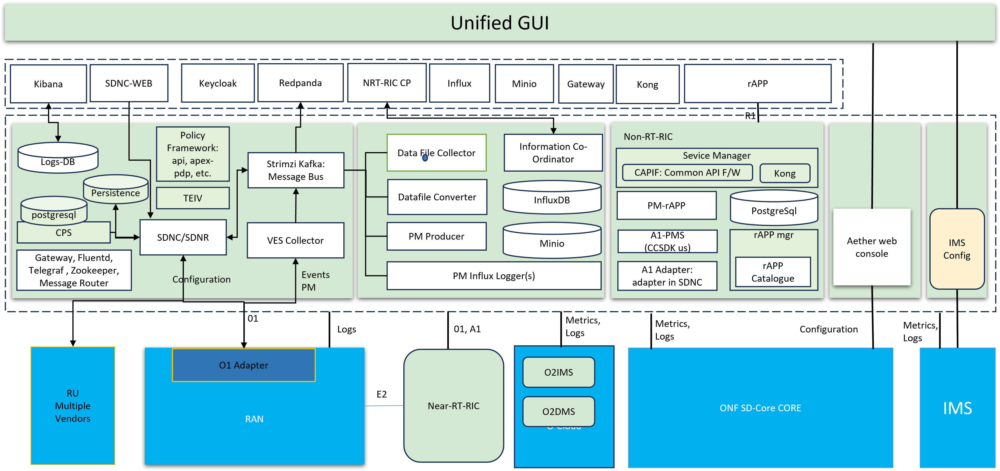

.. This work is licensed under a Creative Commons Attribution 4.0 International License.
.. SPDX-License-Identifier: CC-BY-4.0

OAM and Non-RT-RIC on Kubernetes
================================

This work is taken from o-ran-sc/it-dep/smo-install repo and customized.
All features from the docker-compose variant is retained as is, and the following features are added:

* Configuration persistence
* Policy Framework (mostly used by rApp manager)
* Topology Exposure.
* rApp Manager.

The below figure summarizes the architecture of the K8S variant of OAM and Non-RT-RIC

   OAM Architecture on Kubernetes

Project Resources
-----------------

* The source code is maintained in `oam-k8s` repo.
* Installation: refer to INSTALL.md file in oam-k8s repo.
* Integration: All integration points are exposed through nodeport services.
* UI/Interface: These interfaces are also exposed as nodeport services.
* Please read the Readme in oam-k8s repo for iosmcn-specific customization.
